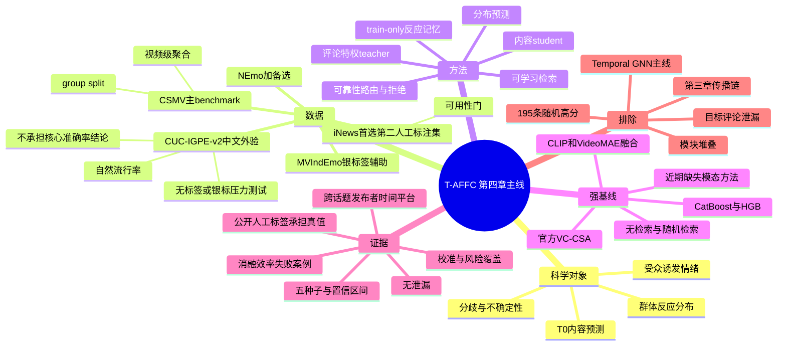
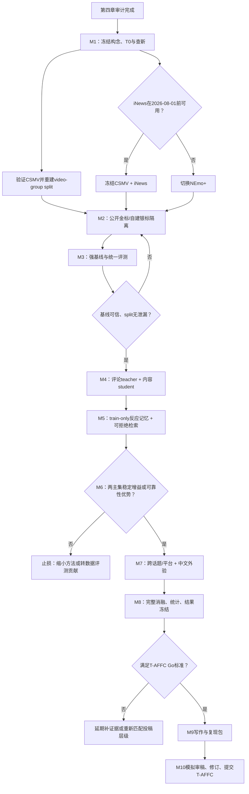

# IEEE T-AFFC 第四章研究十个月总纲（项目唯一主路线）

> 版本：v1.16  
> 冻结日期：2026-07-17  
> 执行周期：2026-07-13—2027-05-12  
> 首要目标：在2027-05-12前形成可直接提交 IEEE Transactions on Affective Computing（T-AFFC）的CARM群体情绪预测论文、代码、数据说明和完整证据链。  
> 研究范围：只继承毕业论文第四章“基于多模态感知与检索的群体情绪预测”；第三章传播链、Temporal GNN 和传播拓扑不作为新论文的方法贡献。  
> 权威性：本文件是后续任务的单一事实源（SSOT）。与 `ieee_tac_gap_and_roadmap_20260713.md` 或更早实验路线冲突时，以本文件为准。

## 0. 总决策

第四章不能按“原48维特征 + CatBoost换成深度学习”的方式小修后冲击 T-AFFC。可保留的研究种子是：

> 对一个尚未获得未来评论的新内容，检索训练集中具有相似内容和相似历史受众反应的案例，预测该内容随后会在受众评论中诱发怎样的群体情绪分布，并在检索不可靠、话题变化、平台变化或内容模态缺失时给出可信的不确定性或拒绝预测。

暂定英文问题表述：

> **Comment-privileged forecasting of public-induced emotion distributions with a calibrated audience-response memory under explicitly available content evidence.**

### 0.1 现实约束（v1.1新增）

- 当前无法组织大规模、多标注者的自建视频人工金标；该限制视为固定项目约束，不再把招募3—5名标注者或标注数千条样本列为关键路径。
- 主要真值必须来自已有人工标注的公开benchmark；自建数据不得以LLM/规则伪标签冒充独立测试金标。
- LLM、多模型集成与规则只能产生训练用银标、置信度或数据筛选信号；所有主要结论必须在公开人工标注测试集上成立。
- 自建数据降为中文自然场景的无标签/银标签外部压力测试，用于报告迁移稳定性、拒绝率、表示漂移和定性案例；没有独立真值时不报告其“准确率提升”作为核心证据。

工作模型暂名 **CARM**（Calibrated Audience-Response Memory，仅为工作名，正式命名前必须查重）。

### 0.2 第二公开人工集范围变更（v1.6，`SC-20260714-01`）

用户批准路径1后，原“第二人工多模态主集”要求降级为“第二人工跨域图像主集/缺失模态验证集”。LAI-GAI v05已按`REVIEW-00-LAI-GAI-FREEZE-20260715`正式冻结；唯一权威版本为847图、63,682条合规人工响应、379组、594/127/126 split。

- CSMV继续承担社交视频域、评论聚合受众分布、视觉内容主协议与评论特权监督；LAI-GAI只承担跨域单图人工诱发分布、结构性输入边界、校准与OOD验证。不得把两者之间的视频/图像域差异写成同一样本的随机缺失模态证据。
- 构念`public-induced audience affect`、`HUMAN_GOLD`、T0、Jensen–Shannon divergence和金标/银标隔离不变。生成prompt、预设目标情绪或模型标签不得充当真值；prompt默认只作provenance，不进入主输入。
- 不得声称两个多模态视频主集。两集统计单位分别为视频和图像，bootstrap按各自内容单元执行。
- CSMV承担H1/H2的主要机制证据；若LAI-GAI缺少同构评论/历史案例字段，H1/H2在该集为`NOT_APPLICABLE_BY_DESIGN`，LAI-GAI主要支持内容分布预测与H3边界。
- 00冻结复审已放行G1；CSMV命名空间、同源split、19项公共核心复现、I3D本地文件树/hash/schema/8210覆盖和序列协议均已闭合。2026-07-17用户明确接受尚未取得资产级许可、稳定官方revision与权利方包身份/fixity证明的延期风险；依据`SC-20260717-01`，G2拆为`G2_PROTOCOL_DATA=PASS_WITH_LIMITATIONS`与`ASSET_ADMISSIBILITY=DEFERRED_ACCEPTED_RISK`，总体`G2=PASS_WITH_ACCEPTED_ASSET_RISK`，允许创建任务20并进行内部研究训练。

### 0.3 效率优先的数据取得政策（v1.11）

用户已明确允许切换第三方镜像并扩大项目内部的许可审查与下载授权范围，以取得效率为优先。统一执行`POLICY-00-EFFICIENCY-FIRST-MIRROR-AND-EXPANDED-ACQUISITION-20260715`：

- 网络路径动态选择：优先加载Git忽略配置中的本机代理；代理不可用或官方链路慢时可直连，也可切换可信第三方镜像。真实代理端点与凭证不进入Git、日志、manifest或报告。
- 公开、无需登录且不收费的数据、特征、媒体、大包与公开API可在记录来源、预计体量、目标目录和磁盘预算后直接进入Git忽略隔离区，不再逐包等待新的内部下载授权。
- 镜像须记录发布者、revision/获取时间、相对路径、体量与hash；优先用官方checksum闭合，没有官方checksum时保留本地SHA-256并尽可能做第二来源或内容统计交叉核验。
- 许可未知的公开资产默认只标`QUARANTINE_ACQUIRED`；法律许可不能由项目自行扩大。唯一例外是`SC-20260717-01`对当前I3D本地包的用户书面风险接受：允许在不再分发特征、不声称官方身份已确认且论文完整披露的前提下进行项目内部训练与评测；该例外不是许可证据，也不适用于其他资产。
- 继续禁止绕过登录、访问控制、验证码、付费墙、地域/账户权限或服务配额；付费、EULA/DUA和机构承诺仍须用户另行确认。
- 下载继续采用`.part`、续传、有限并发/重试、完成后原子改名与SHA-256。T0、split泄漏、隐私和金标/银标隔离门不变。
- 当前CSMV I3D本地包已按风险接受路径进入任务20；仍可并行等待权利方回复或寻找官方fixity证明，但不得因此改变已冻结输入字节、split或序列协议。

### 0.4 音频模态与实际可得输入边界（v1.12，`REVIEW-00-AUDIO-MODALITY-PROTOCOL-20260716`）

- CSMV音频冻结为`STRUCTURALLY_UNAVAILABLE_NOT_IMPUTED`，不作为G2或任务20启动的独立前置条件；不再进入后续取得、下载、许可协调和存储预算关键路径。
- CSMV内容输入收敛为一个固定I3D视觉特征族；其内部研究使用由`SC-20260717-01`的用户风险接受授权，评论仅作人工标签来源、训练期特权监督或train-only反应记忆，不得进入T0学生推理输入。
- “完整模态”统一改称`ALL_AVAILABLE_INPUTS`，只表示某数据协议在T0合法、冻结且实际可得的全部输入。若只有一个内容模态，逐模态增量记`NOT_APPLICABLE_SINGLE_AVAILABLE_INPUT_MODALITY`。
- 随机缺失、缺一/缺二模态和逐模态增量只允许在同一样本实际含至少两个T0合法输入模态的数据协议上运行。CSMV音频分支固定为`NOT_APPLICABLE_AUDIO_UNAVAILABLE_BY_DATASET_DESIGN`；若没有合格协议，H3降为`NOT_APPLICABLE_NO_ELIGIBLE_MULTIMODAL_PROTOCOL`。
- 音频裁定本身不提供I3D许可信用；后续`SC-20260717-01`仅以用户接受风险的方式放行内部I3D研究使用。仍不得声称音视频融合、音频增益、音频缺失鲁棒性、伪音频补齐或端到端原始帧/音频编码改进。

### 0.5 I3D序列处理协议（v1.13，`REVIEW-00-CSMV-I3D-SEQUENCE-PROTOCOL-20260716`）

- 主协议冻结为`FULL_SEQUENCE_DYNAMIC_PADDING_MASK`：完整保留`float32[T,1024]`序列，batch内右补零并以`True=observed`的布尔mask区分观测；所有split执行同一规则，不允许test自适应。
- 主敏感性冻结为`UNIFORM_180_ENDPOINT_INCLUSIVE`；`FIRST_180_ONLY_FIXED_DIAGNOSTIC`仅作补充，不得按test表现升级。8,210个必需输入中531个`T>180`、最长1,719，故不能默认前180等同完整序列。
- 资源合同为确定性长度分桶、`max_batch_size=64`、64 MiB原始输入张量门；若模型激活/梯度造成显存不足，只能确定性减小batch，不能静默截断或改协议。
- 论文只能声称冻结I3D视觉表征上的受众情绪分布预测，不能声称端到端视频编码、原始帧学习、音视频融合、音频增益或评论正文T0输入。
- 00已关闭`I3D_SEQUENCE_PROCESSING_PROTOCOL_UNFROZEN`子缺口。资产级许可、稳定官方revision、本地包身份及权利方fixity仍为`DEFERRED_ACCEPTED_RISK`；这不改变未知事实，但按`SC-20260717-01`不再阻塞G2协议/数据门和任务20内部实验。

### 0.6 IJCV方向已独立迁出（v1.15，`SC-20260716-03`）

- v1.14双路线总纲已在修改本文件前完整交付到独立Codex项目`D:\MMSA-CH-SIMS - IJCV方向`，由分支`codex/ijcv-j0`和提交`c64c954`继续维护。
- 本项目从v1.15起只执行T-AFFC的CARM路线；J0—J2、JH1—JH3、任务25、任务65、IJCV专刊日历和投稿门均不再属于本项目的启动条件、交付物或资源计划。
- `IJCV_TAFFC_DUAL_TRACK_FEASIBILITY_AND_PLAN_20260716.md`与决策`SC-20260716-02`仅作为历史范围变更证据保留，不再覆盖本总纲任何章节。
- 两个项目若需共享通用数据事实或基础工具，只能通过已提交Git状态和书面交接消费；不得并发修改同一实验核心、互相改变主问题或把另一项目的主方法/主结果纳入本稿。

### 0.7 G2拆分与任务20放行（v1.16，`SC-20260717-01`）

- `TASK00_G2_NON_ASSET_COUNTERFACTUAL_REVIEW_20260717.md`已现场确认：排除资产外部证明后，样本血缘、标签隔离、T0评论隔离、泄漏正负门、LAI-GAI第二主集、I3D序列协议、19项隔离复现和M2本地发布包全部通过，没有第二个非资产G2阻塞。
- G2自本版拆为两层：`G2_PROTOCOL_DATA=PASS_WITH_LIMITATIONS`是任务20启动科学门；`ASSET_ADMISSIBILITY=DEFERRED_ACCEPTED_RISK`是持续风险账，不再阻断内部基线、训练、索引与评测。
- 全局状态改为`G2=PASS_WITH_ACCEPTED_ASSET_RISK`、`formal_split=true`、`internal_model_use_allowed=true`，任务20获准创建。允许使用的I3D字节只能来自已固定的本地隔离包与8210项manifest；禁止静默替换。
- 风险接受不产生或扩大法律许可。I3D特征不得进入Git、公开复现包或再分发；论文及Data Card必须披露资产许可/revision/权利方fixity未确认，并提供获取说明、ID/split/处理代码和本地hash证据。
- 不得使用“官方资产已确认”“权利方已授权”“官方checksum闭合”等措辞。若维护者后续否认研究使用或包身份，立即暂停依赖I3D的正式结果并回到任务10更换合法输入或收缩论文。

这条路线与第四章的对应关系是：

| 第四章原设计 | 新论文升级 |
|---|---|
| 同作者、关键词、推荐三路检索 | 训练集内、可审计、无未来信息的多路检索记忆 |
| TF-IDF/LSA/封面哈希排序 | 预训练文本、图像/视频编码器 + 可学习的情感相关检索 |
| 历史视频四类统计量 | 历史案例的受众反应分布、置信度、时间与域信息 |
| 3×4×4 的48维向量 | 查询—邻居交互与可靠性门控的证据表示 |
| CatBoost二分类 | 群体情绪分布、分歧、风险与不确定性的多目标预测 |
| 随机80/20 | 按视频、话题、发布者、时间和平台隔离的无泄漏评测 |
| “需要/无需预警” | 以细粒度受众情绪分布为主，二分类预警仅作兼容性次任务 |

## 1. 当前事实与不能继续沿用的证据

### 1.1 可利用资产

- 论文第四章提出了“历史相似案例 → 群体情绪预测”的明确检索范式。
- 现有自建目录约 20.92 GiB，含标题、标签、简介、评论、发布时间、发布者、互动量、相关视频、封面 URL、连续情绪值和48维向量。
- 当前可加载 2787 条48维样本，标签为 0 类1444、1类1343；有 2779 个唯一 BV。
- CatBoost、HGB、Self-MM、MW+EP、LLM情绪元、BERT、GCN/Temporal GNN 已有探索代码，可用作历史实验或基线资产。
- CSMV/MSA-CRVI 已公开 8210 个微视频、107267 条人工标注评论及 I3D/VideoMAEv2 特征，和本研究对象高度一致。

### 1.2 必须废弃或降级的旧证据

- 论文报告的 CatBoost Accuracy 90.07% 未能复现；当前同类随机划分结果为 Accuracy 82.26%、F1 80.78%，50个种子均值约83.00%。
- 论文表4.3的90.07%与表4.4同条件Top-3的76.43%互相矛盾；正文所谓“提升4.83%”也与表中13.65个百分点不符。
- 当前2787条与论文2815条相差28条；有221条向量标签与本地标签表冲突，数据版本不能混用。
- 原始需预警比例约9.5%，后来被调整到接近1:1；该平衡测试集不能代表真实部署流行率。
- 当前随机划分让39个测试发布者中的38个也出现在训练集；同作者路径贡献65%，存在严重发布者捷径。
- 当前195条 LLM/Temporal 子集只有4个发布者、2个话题；时间戳全部为0，所谓 chronological split 只是文件顺序切分。
- LLM/BERT使用目标视频高赞评论，而目标标签也来自目标评论；若声称发布早期预测，这是直接结果泄漏。
- 现有GNN在划分前构全图，是传导式设置；它不属于本次第四章主线。

结论：旧结果只用于说明“做过哪些探索”，不能作为新论文的验证结果；正式论文所有表格必须从新协议重跑。

## 2. 冻结研究对象与预测时点

### 2.1 构念

本论文研究的是 **public-induced audience affect**：同一内容发布后，多个受众在评论中表达的情绪反应分布。它不同于：

- CH-SIMS/MOSEI中的“视频说话者自身情绪”；
- GAF等数据中的“画面里多人群体的共同情绪”；
- 第三章的信息传播链指标。

论文主输出为：

1. K类受众情绪经验分布；
2. 群体分歧程度（优先用分布熵/离散度；只有构念验证后才称“极化”）；
3. 预测不确定性与拒绝预测分数；
4. 兼容旧论文的二分类风险标签（次任务，阈值仅在训练集冻结）。

### 2.2 预测协议

主任务冻结为 **T0内容预测**：

- 推理输入：目标内容在发布时可见的文本、封面/视频、话题和发布者公开元数据；
- 允许使用：训练集或严格早于目标发布时间的历史案例；
- 禁止使用：目标内容未来评论、未来互动量、发布后推荐结果及任何标签生成中使用的信息；
- 预测目标：随后评论中形成的受众情绪分布。

可选次任务为 **T+Δ早期预警**：只在评论时间戳恢复后，用前Δ小时评论预测更晚窗口；它必须与T0任务分开，不能混用输入。

统计单位、划分单位和bootstrap单位均为“视频/帖子”，不是评论、fold或随机种子。

## 3. T-AFFC论文的三项贡献上限

### C1：无泄漏的公众诱发情绪预测协议

- 评论仅在训练期作为标签或特权监督，推理时不可见；
- CSMV重新按 `video_file_id` 分组划分，杜绝同一视频评论跨train/test；
- 自建数据按时间、发布者、话题与检索图连通分量隔离；
- 从单一硬标签升级为群体反应分布、分歧与不确定性。

注意：公众诱发情绪和分布预测已有前作，不能声称“首次提出任务”。贡献在严格预测协议和系统证据，而不是重新命名已有任务。

### C2：评论特权教师 + 可拒绝的受众反应记忆

- 教师模型在训练期读取评论和内容，学习个体反应与视频级经验分布；
- 内容学生在训练和推理时只依赖允许的内容模态；
- 记忆库只存训练视频的内容表示、经验反应分布和置信信息；
- 检索器找“内容相似且受众反应有预测价值”的历史案例；
- 可靠性路由器根据相似度、邻居分歧、域距离、时间距离和模态缺失决定融合、降权或拒绝检索，避免负迁移。

这不是用检索“伪造缺失图像”，也不是一般RAG问答；必须与RAMER、RAER等直接前作做差异实验。

### C3：跨话题、跨平台和自然缺失下的可靠性证据

- 主公开集上做group-by-video、topic/hashtag-held-out和缺失模态实验；
- 在CSMV与第二个人工标注公开集之间做跨数据/跨场景验证；MVIndEmo只作银标签辅助压力测试；
- 自建Bilibili数据作为中文、跨平台、自然缺失外部验证；
- 同时报告分布误差、校准、选择性风险、效率和失败案例，而不是只报Accuracy。

若十个月内C1—C3无法同时形成证据，宁可缩小贡献，也不能继续叠加原型、GNN、LLM或更多模块。

本项目后续所有模型、实验和写作只服务C1—C3；不再承担独立视觉表征论文的设计、数据门或投稿任务。

## 4. 数据路线与第一月选择门

### 4.1 主公开 benchmark A：CSMV/MSA-CRVI（确定优先）

- 8210个微视频、107267条人工标注评论；
- opinion为正/中/负，emotion为Plutchik八类；
- 官方提供I3D/VideoMAEv2时序特征、评论标注、URL与代码；
- 官方7:1:2按comment ID随机划分可能让同一视频跨集合，必须重做按视频分组划分；
- 按视频聚合评论标签，形成经验受众反应分布与样本量不确定性。

### 4.2 第二公开人工集B：LAI-GAI跨域图像主集（v1.7正式冻结）

- 正式冻结847张AI生成图像、六项研究和63,682条合规逐图人工响应；图像—评分—canonical—split为847/847；
- 许可、固定版本、逐图size/SHA-256、12维HUMAN_GOLD、379组及精确/近重复零跨split均已通过专项门；
- 单图天然不包含音频和视频时序，只用于跨域图像、结构性输入边界、校准与OOD验证，不冒充第二视频复现集，也不替代同一样本随机缺失模态实验；
- 生成prompt、目标生成类别和模型标签不是受众反应真值，默认不得作为主模型输入。

**冻结规则**：唯一权威为`LAI-GAI@v05-2026-03-11`、canonical SHA-256 `ad58c268e34adf02bd8e639338069d34576e1d9602f819a2cc6fa89be6836818`、split 594/127/126。任何标签映射、group或split变化必须升版并重新经过00复审；不得保留另一套正式split。旧OSF API偏差保留为历史证据，不影响后续独立授权形成的冻结事实。

### 4.3 银标签辅助集：MVIndEmo

- 7153个TikTok微视频、8个话题；
- 提供hard label和soft public-induced emotion distribution；
- 标签由三个评论情感模型置信融合并按评论点赞聚合，规模大但属于自动标签；
- 论文所列仓库在2026-07-13审计时不可直接访问，必须联系作者或找到合法镜像。
- 即使数据可获得，也不承担第二个人工金标测试集角色；只用于预训练、弱监督迁移或银标鲁棒性分析。

### 4.4 备选/机制增强数据

- **NEmo+**：1297个新闻图文对、38910条众包反应，同一内容有T/I/TI三种条件；适合验证“增加图像后反应分布如何变化”。
- **MVIndEmo**：若可获得，作为微视频域银标签辅助集，不用于替代人工真值。
- 图像可得性、版权和gated数据访问在第一月审计；不同时承诺全部做完。

### 4.5 自建 CUC-IGPE-v2（只作外部验证）

需要建立canonical表：

`video_id + topic + publisher + publish_time + title + tags + intro + cover + allowed_metadata + future_response_label + provenance`

重建要求：

- 解决2815/2787漂移、221条标签冲突、重复BV与缺失时间；
- 所有检索候选严格满足 `candidate_time < query_time`；
- 目标评论和最终互动量不进入T0输入；
- 不再人为平衡自然流行率；训练时用损失加权，测试保留真实分布；
- 原始音视频缺失不伪造；封面URL恢复率足够时使用文本+封面+元数据，否则明确自然缺失；
- 不再要求大规模人工重标。可选做不超过50—100条的作者盲审，仅用于发现格式、讽刺和标签定义错误，不计算正式模型优越性；如果连小规模审查也不可行，直接省略；
- 可用多个开源中文情绪模型、LLM和透明规则生成带不确定性的银标，但银标只用于训练适配、拒绝策略与案例分析，不能作为主测试真值；
- 中文外验的定量主报告限定为无标签可计算指标（预测熵、拒绝率、跨模型一致率、域距离、检索覆盖率）及与原48维/CatBoost输出的稳定性比较；
- 用户名、评论和平台凭证不得直接公开，必须做匿名化、许可与伦理审计。

## 5. 最小模型结构

```text
训练期评论 ──> 反应教师 ──> 个体反应/视频级分布 ──┐
                                                   ├─> 蒸馏与分布监督
内容文本/图像/视频 ──> 模态编码器 ──> 内容学生 ──┘
                                   │
                                   ├─> train-only反应记忆检索
                                   │       ├─ 内容相似度
                                   │       ├─ 历史反应分布
                                   │       └─ 域/时间/模态质量
                                   │
                                   └─> 可靠性路由器 ──> 分布 + 分歧 + 不确定性 + 可选风险
```

实现纪律：

- 编码器优先冻结或LoRA：文本用强预训练文本编码器；图像用CLIP/SigLIP；视频优先复用官方VideoMAE特征；
- 不从头训练大型视频模型或72B MLLM；单卡12—24GB应能完成主实验；
- 输出先用softmax/Dirichlet两种简单头比较，不提前堆复杂生成模块；
- 模态缺失用mask、modality dropout和可靠性估计处理；原型库仅作为可选对照，不作为标题创新；
- StepFun/其他闭源LLM只能作离线教师或对比，提示词、模型版本、缓存和人工审核必须留档；主系统不得依赖不可复现API；
- CatBoost/HGB可接冻结深度特征作为混合基线，深度学习并不因CatBoost随机划分高分而被排除。

## 6. 可证伪假设

| ID | 假设 | 主检验 | 反证/止损条件 |
|---|---|---|---|
| H1 | 评论特权教师能改善内容学生对未来群体反应分布的预测 | CSMV的JS/NLL；第二集仅在存在同构评论证据时检验 | CSMV相对最强content-only基线无稳定改善，或提升只来自随机划分；第二集缺同构字段时记`NOT_APPLICABLE_BY_DESIGN` |
| H2 | train-only反应记忆在相关域中有效，可靠性拒绝可减少OOD负迁移 | learned retrieval vs no/random/BM25/CLIP-kNN；AURC/ECE | 随机检索同样好，或跨话题/平台下校准和分布误差更差 |
| H3（条件性） | 在同一样本至少含两个T0合法、冻结、实际可得输入模态的协议上，质量/缺失感知可使单一模型平稳退化 | 仅在合格协议上比较`ALL_AVAILABLE_INPUTS`、单模态和随机/自然缺失；CSMV音频记`NOT_APPLICABLE_AUDIO_UNAVAILABLE_BY_DATASET_DESIGN` | 不优于简单late fusion/zero-fill/近期缺失模态基线；若无合格协议则整体降级为`NOT_APPLICABLE_NO_ELIGIBLE_MULTIMODAL_PROTOCOL` |
| H4（增强） | 配对模态条件能帮助预测加入图像后受众反应分布的变化 | NEmo+上的 `p_TI-p_T`、`p_TI-p_I` | 无法超过独立预测两个分布后相减的简单基线 |

主成功门：CSMV以视频为单位、第二公开人工集以其原生内容单元为单位执行paired bootstrap 95%置信区间。CSMV承担核心机制主张；第二集承担独立人工真值上的跨域分布、校准/OOD和适用的缺失模态证据。不得把第二集不适用的H1/H2记为通过，也不得要求虚构同构实验。单个随机split高分不算成功；G4/G6仍须据证据降级后的真实充分性决定投稿。

## 7. 实验矩阵

### 7.1 必跑基线

1. 总体均值/主题均值/多数类/经验分布基线；
2. 原论文48维 + CatBoost、HGB、LightGBM；
3. CSMV官方VC-CSA及数据集官方基线；
4. 冻结CLIP/SigLIP/VideoMAE + MLP、late fusion、cross-attention；
5. content-only student、teacher-only上界、普通蒸馏；
6. 无检索、随机检索、BM25/TF-IDF、CLIP/SBERT kNN、可学习检索；
7. RAMER式检索适配；仅在存在至少两个实际T0输入模态的合格协议时运行至少两个缺失模态强基线，否则登记`NOT_APPLICABLE`；
8. 开源小型MLLM零/少样本参考（仅作对照，不作为公平训练基线的替代）。

所有基线必须同数据、同划分、同测试脚本，并给予可比的调参预算。

### 7.2 必跑实验

| 实验 | 唯一变化 | 目的 |
|---|---|---|
| E0 | 数据/划分sanity check | 检测重复视频、同源事件、目标评论、未来候选泄漏 |
| E1 | 实际单输入与`ALL_AVAILABLE_INPUTS` | 证明实际可得输入的增量；仅一模态时记`NOT_APPLICABLE_SINGLE_AVAILABLE_INPUT_MODALITY` |
| E2 | 检索方式 | learned vs no/random/BM25/CLIP-kNN |
| E3 | 去教师/去蒸馏 | 隔离评论特权监督贡献 |
| E4 | 去可靠性路由/固定权重 | 隔离拒绝和校准机制 |
| E5 | 合格协议上的缺失模式和缺失率 | 仅对同一样本至少两个实际T0输入运行缺一/自然/10/30/50/70%缺失；CSMV音频结构性缺失不进入随机删失实验 |
| E6 | OOD | topic/hashtag、publisher/source、time、platform held-out |
| E7 | 检索污染 | 错邻居、低相似邻居、库缩小、top-k扫描 |
| E8 | 兼容旧任务 | 自然流行率上的Macro-F1、AUPRC、Recall、Brier与决策成本 |
| E9 | 效率 | 参数量、显存、训练/推理时间、索引大小与检索延迟 |

### 7.3 指标与统计

- 主要分布指标：Jensen-Shannon divergence（主）、NLL、Wasserstein/EMD；
- 次指标：dominant emotion Macro-F1、Balanced Accuracy；旧二分类另报AUPRC、Recall；
- 分歧：真实分布熵与预测分布熵的MAE/相关；若定义极化，需另做构念验证；
- 校准：Brier、ECE/ACE、risk-coverage、AURC；
- 检索：Recall@K/nDCG@K、检索邻居反应分布一致性、负迁移率；
- 统计：至少5个随机种子；按数据集原生内容单元（CSMV视频、第二集图像）做paired bootstrap 95%CI；配对检验与多重比较校正；
- 不把seed或fold数量当独立样本量。

## 8. 十个月月度路线

本节是本项目唯一有效日历。阶段按G1—G6顺序推进，最终目标日期为2027-05-12；独立IJCV项目的日程不得改变本路线的门或资源优先级。

### 开工准备包（M1开始前，最多3个工作日）

这是启动条件，不是新的研究工作包；完成后立刻进入第1月数据审计。

| 类别 | 必做准备 | 验收标准 |
|---|---|---|
| 研究边界 | 建立一页 `T0_INPUT_POLICY.md`：允许输入、禁止输入、标签窗口、统计单位 | 明确禁止目标未来评论、最终互动量和测试/未来检索候选 |
| 目录与版本 | 建立数据原件只读区、处理数据区、代码区、实验配置区、结果区和文稿区；初始化Git与`.gitignore` | 不把原始评论、Cookie、API key、模型权重和大型数据纳入Git |
| 环境 | 固定Python、CUDA、PyTorch、transformers、faiss、scikit-learn、CatBoost版本；导出锁定文件 | 在空环境中执行一次最小导入检查 |
| 数据与存储 | 预留公开特征、缓存、索引和实验结果空间；记录来源、许可、下载日期与SHA-256 | CSMV及第二候选数据都具备可追溯来源记录 |
| 实验纪律 | 建立统一配置模板：数据版本、split、T0、种子、输入模态、基线、主指标和停止条件 | 每个实验可由单一配置文件重跑 |
| 安全与合规 | 轮换已经暴露的凭证；使用`.env`和环境变量；确认数据不上传公开仓库 | 密钥扫描为零，原始评论与用户标识不公开 |
| 时间与资源 | 每周固定两个深度工作时段；指定本地GPU和云端备用预算上限 | 连续10个月每月保留至少4天缓冲，不因补采视频占用主线 |
| 文献与写作 | 建立Zotero/BibTeX库和“claim—evidence”表 | 每条核心主张有来源或标记为待验证 |

**开工原则**：不购买硬盘、不批量补采视频、不调用付费LLM、不训练新模型，直到CSMV与第二人工标注候选通过M1数据/许可门。

**执行状态（2026-07-14）**：本地可完成的准备项已补齐，验收见 `PREPARATION_ACCEPTANCE_REPORT.md`。重复检查确认M1只读许可核查与数据可行性审计可以开始；正式CARM环境、空环境重建、faiss后端和账户侧凭证轮换仍处于门控状态，因此当前不得训练新模型或调用API/付费服务。

### Codex项目、任务与算力分工（v1.4修订）

- **Codex项目是十个月工程容器**：项目根目录建议固定为 `D:\MMSA-CH-SIMS`，统一承载代码、配置、文稿、实验台账和阶段任务。
- **Codex任务是项目内的工作线程**：保留一个“00-总控与决策”任务维护总纲；M1数据审计、M3基线、M4教师学生、M5检索记忆和论文写作分别在需要时创建独立任务，避免单个任务无限膨胀。
- **本地文件仍是SSOT**：项目和任务用于组织上下文，数据版本、split、实验配置、结果和决策必须写回文件，不能只存在聊天记录中。
- 当前任务若不属于 `D:\MMSA-CH-SIMS` 项目，可在该目录新建Codex项目任务，并通过总纲和项目记忆文件接续；不需要复制原始数据或重新分析历史。
- **Matgo作为按需GPU执行平台**：M1—M3优先CPU/本地运行；M4以后使用单卡24GB级GPU和冻结/预提取编码器为默认，只有端到端视频训练或并行正式实验才申请更高规格。
- 租用实例前检查：Linux/SSH、CUDA与PyTorch兼容、持久盘、外网下载、快照/关机计费、数据导出和实例销毁流程。训练结束先同步配置、日志、预测与权重摘要，再释放实例。

### 第1月：问题、数据与查新冻结（2026-07-13—2026-08-12）

任务：

- 完成第四章claim—evidence审计、代码数据lineage和安全审计；
- 下载并验证CSMV标注、视觉特征、官方代码和许可；
- 优先验证iNews数据许可、标签与多模态输入，8月1日执行可用性门；不可用则切换NEmo+；
- 联系MVIndEmo作者/寻找合法镜像，但将其固定为银标签辅助集，不阻塞主线；
- 对自建数据做BV—标题—发布时间—评论—标签canonical映射，抽样检查200条封面/视频URL恢复率；
- 对“评论特权监督、反应记忆、可拒绝检索、分布学习”做贡献级系统查新；
- 冻结T0输入、标签、主指标、划分、假设和失败条件；
- 撤销已暴露的API/平台凭证，后续全部改用环境变量。

交付物：数据可行性表、许可/伦理表、研究问题v1、实验协议v1、泄漏威胁模型、baseline清单。

退出门G1：至少两个合法可用的公开数据源；CSMV按视频分组可构造；第二数据集已确定；自建数据的真实时间可恢复或被明确降级。否则停止模型开发。

### 第2月：无泄漏benchmark与标签工程（2026-08-13—2026-09-12）

任务：

- 构建CSMV视频级经验反应分布，重做group-by-video和topic/hashtag-held-out划分；
- 构建第二公开集统一标签映射；
- 建立数据处理单元测试：同视频、近重复、同源事件、未来候选和目标评论零泄漏；
- 建立CUC-IGPE-v2 canonical表，保留自然流行率；
- 构建“公开金标—自建银标”双层标签管线：公开人工标签只用于正式评测，自建银标只用于训练适配/压力测试；
- 对自建评论运行多教师一致性、置信度过滤和噪声敏感性分析；可选抽查50—100条，但不设为退出门；
- 形成Data Card、Datasheet、隐私和平台条款说明。

交付物：dataset-v1、split-v1、label-provenance-v1、silver-label-pipeline-v1、数据审计报告、可复现预处理脚本。

退出门G2：所有样本可追溯；测试评论从输入中物理隔离；两个公开集的人工标签能构成正式测试；自建银标与公开金标在文件、代码和论文表述中物理隔离。银标质量不足时只取消自建适配，不阻塞公开benchmark主线。

### 第3月：强基线与统一评测（2026-09-13—2026-10-12）

任务：

- 复现CSMV官方基线；
- 跑统计、传统ML、冻结深度编码器、普通融合和旧M-DRGE基线；
- 建立分布、校准、OOD和检索的统一评测器；
- 等预算调参，记录配置、种子、环境、日志和预测文件；
- 在不看测试结果的条件下冻结超参数搜索空间。

交付物：baseline-table-v1、evaluation-kit-v1、复现实验报告、失败基线清单。

退出门G3：至少一个官方/强基线被可信复现；所有基线用同一split与评测器。未过门不得开发复杂新模型。

### 第4月：评论特权教师与内容学生（2026-10-13—2026-11-12）

任务：

- 训练评论反应teacher，聚合视频级分布；
- 实现只看内容的student和最简单分布蒸馏；
- 对比hard label、soft distribution、comment-privileged supervision；
- 分析样本评论数、标签噪声和teacher置信度的影响。

交付物：teacher/student-v1、H1主实验、单变量消融、误差案例。

止损：teacher不能在开发集形成稳定有效的分布监督，先修标签和聚合，不叠加检索。

### 第5月：train-only受众反应记忆（2026-11-13—2026-12-12）

任务：

- 建立train-only memory和严格索引生命周期；
- 实现BM25/CLIP-kNN与可学习检索；
- 实现查询—邻居反应分布融合；
- 加入相似度、邻居分歧、域距离和模态质量驱动的可靠性路由；
- 用随机/错误邻居检验模型是否真的利用了有效证据。

交付物：CARM-v1、H2结果、检索可视化、负迁移分析、top-k研究。

止损：随机检索与学习检索无差异，或检索在OOD上持续伤害且无法被拒绝机制识别，则撤掉检索创新，转为comment-privileged distribution forecasting论文。

### 第6月：第一次正式Go/No-Go（2026-12-13—2027-01-12）

任务：

- 在CSMV与通过准入的第二公开人工集完成各自适用的5种子实验；
- 跑主要消融、bootstrap CI、校准和缺失模态；
- 与最强公平baseline比较，完成第一次审稿人式内部评审；
- 冻结是否加入NEmo+配对模态增强，避免继续扩张。

退出门G4：H1/H2至少一条在CSMV成立；第二公开人工集对其适用的跨域分布、校准/OOD或H3边界提供独立证据。`NOT_APPLICABLE_BY_DESIGN`不得写成通过，随机split不是唯一优势，校准不恶化。否则降低目标、重构问题或转数据/评测贡献，不再堆模块。

### 第7月：跨话题、跨平台与中文外部验证（2027-01-13—2027-02-12）

任务：

- topic/hashtag/source/time held-out；
- LAI-GAI（若通过准入）↔CSMV之间做跨数据/跨场景验证并明确图像—视频、标签空间和统计单位差异；MVIndEmo仅补充银标迁移实验；
- 迁移到CUC-IGPE-v2中文无标签/银标签压力测试，使用发布者/话题/时间隔离；
- 比较无适配、轻量适配、检索记忆和拒绝策略；
- 检查不同主题/发布者的预测熵、拒绝率、域距离、检索覆盖和跨模型一致性；没有独立金标时不声称准确率或校准提升。

交付物：OOD-table-v1、跨平台矩阵、中文外验报告、失败域案例。

退出门G5：若发布者/话题/平台外推仍接近随机且无法解释或拒绝，不能以T-AFFC完整方法论文直接投稿。

### 第8月：完整消融、鲁棒性与结果冻结（2027-02-13—2027-03-12）

任务：

- 完成E0—E9实验矩阵；
- 补齐缺失率、检索污染、效率、风险覆盖、阈值敏感性；
- 做配对统计、效应量、CI和多重比较校正；
- 固定主结果，禁止再根据测试集改主假设；
- 建立每条论文claim到表格/图/预测文件的证据映射。

交付物：results-freeze-v1、ablation-final、statistics-report、claim-evidence-map。

退出门G6：两个公开人工标注主集、中文压力测试、强基线、公平调参、完整统计、主要失败分析全部完成。中文集无人工真值不是阻塞项，但其证据等级和局限必须明确。否则延期投稿，不用不完整实验硬冲T-AFFC。

### 第9月：论文、图表与可复现包（2027-03-13—2027-04-12）

任务：

- 按“问题—协议—方法—证据—边界”写完整英文稿；
- 生成出版级架构图、数据图、OOD/校准图和案例图；
- 整理匿名代码、配置、环境、模型权重、日志和预测文件；
- 发布合法的数据ID/特征/划分，无法发布的原始评论只给处理脚本与说明；
- 写伦理、隐私、局限、LLM使用和数据许可声明；
- 进行一次独立学术诚信、引用和一致性审计。

交付物：manuscript-v1、anonymous-repo-v1、reproducibility-checklist、data/model cards。

### 第10月：预审、修订与投稿（2027-04-13—2027-05-12）

任务：

- 模拟AE + 3位审稿人 + 反方审稿；
- 针对构念错位、撞车、泄漏、跨域、标签效度和统计问题逐条修订；
- 检查T-AFFC最新作者指南、格式和补充材料；
- 冻结论文、代码和数据版本；
- 以T-AFFC为第一投稿目标提交。

交付物：submission-ready-v1、review-audit、cover letter、最终归档包。

说明：十个月目标是“高质量提交”，不是保证十个月内录用。若G4/G5/G6不通过，再根据届时官方截稿日期和贡献形态评估ACM MM、ICMI、ACII或较低一级期刊；不得一稿多投。

## 9. 人力、算力与管理节奏

- 算力：优先使用官方预提取VideoMAE/I3D特征、冻结CLIP/SigLIP和小型student；单张12—24GB GPU为可行配置。
- 标注：不安排大规模新人工标注。优先复用公开benchmark已有人工标签；自建集采用多教师银标和无标签压力测试。可选50—100条错误审查仅服务数据清洗，不承担主结论。
- 存储：先审计特征包与URL可用性，再决定是否下载原视频；不在未确认许可前批量抓取。
- 每周：一次数据/泄漏检查，一次实验复盘；每月末只允许一个模型主版本进入下一阶段。
- 每项实验必须登记：计划ID、数据版本、split版本、输入时点、baseline、唯一变化、主指标、失败条件、配置、日志和预测文件。

## 10. 明确不做的事项

- 不把第三章传播链、GCN或Temporal GNN并入主模型；
- 不把CH-SIMS/Self-MM结果作为“受众群体情绪”的主要证据；
- 不用目标高赞评论、最终互动量或未来相关视频预测T0标签；
- 不再用195条子集的96%随机分数写论文结论；
- 不追逐复现不了的90.07%，而忽略时间/发布者/平台泛化；
- 不把“MW+EP”“动态权重”“RAG+MER”“使用大模型”单独写成创新；
- 不用LLM生成伪音频/伪视频冒充真实模态；
- 不同时做音频、视频、图像、文本、GNN、RAG、72B大模型和新数据集；
- 不在测试结果出现后偷偷更换主指标、阈值或假设。

## 11. T-AFFC 投稿Go标准

只有同时满足下列条件，才直接提交T-AFFC：

1. 两个任务匹配的公开主数据集可合法复现；
2. 评论与未来互动从推理输入中物理隔离，所有检索索引只含训练/历史数据；
3. group-by-video、topic/source/time/platform OOD协议齐全；
4. 对最强公平基线在分布误差或可靠性上形成稳定、统计支持的优势；
5. 每个核心组件有独立消融，随机检索和错误邻居负对照通过；
6. 自建中文集若无独立人工真值，只报告压力测试与探索性证据；论文的主要定量结论全部来自两个公开人工标注主集；
7. 五种子、按数据集原生内容单元的CI、校准、效率、失败案例和伦理说明完整；
8. 代码、配置、split、日志、预测文件和可发布数据全部可追溯；
9. 模拟审稿中不再存在“构念错位、未来泄漏、模块拼接、随机划分高分”四类Critical问题。

## 12. 项目总览思维导图



## 13. 当前任务流程图



## 14. 决策记录表

| 日期 | 决策 | 原因 | 被否决/备选 | 下一步 |
|---|---|---|---|---|
| 2026-07-04起 | 先复现原论文CatBoost和48维流程 | 建立可运行基线与数据理解 | 直接重写深度模型 | 保留为legacy baseline |
| 2026-07-04起 | 引入CH-SIMS/Self-MM做公开benchmark探索 | 解决自建数据无标准benchmark问题 | 只在自建集随机划分 | CH-SIMS降为构念不匹配的辅助资产 |
| 2026-07-05起 | 探索MW+EP、温度、原型与多种消融 | 研究自适应融合和细粒度标签 | 固定CatBoost | 不再作为T-AFFC核心创新 |
| 2026-07-09起 | 探索LLM情绪元、Temporal、GCN | 尝试利用评论与传播信息 | 只用48维 | 因时间戳为0、目标评论泄漏及构念偏离，移出正式证据 |
| 2026-07-10 | CatBoost与HGB正式比较，不预设赢家 | 模型优劣依赖划分；随机高分不等于泛化 | 固定某一分类器 | 两者均保留为强表格基线 |
| 2026-07-13 | T-AFFC为第一终极投稿目标 | 主题在期刊范围内，但需要顶刊证据链 | 直接小修低级期刊 | 十个月形成submission-ready包 |
| 2026-07-13 | 只继承第四章，第三章传播链不入主线 | 用户明确选择，且传播链会分散问题 | 继续做Temporal GNN | 只保留第四章“多模态感知+检索”研究种子 |
| 2026-07-13 | 不能直接忽略第三章标签依赖，必须重建 | 第四章初始标签由第三章计算+GMM产生 | 直接沿用二分类标签 | 重建独立受众反应分布与中文标注证据 |
| 2026-07-13 | 主问题改为“推理无未来评论的公众诱发情绪分布预测” | 与第四章目标、公开数据和无泄漏要求一致 | 普通MER、说话者情感识别 | 冻结T0输入和future-response标签 |
| 2026-07-13 | 初始选择MVIndEmo为第二主集（已被v1.1取代） | 与微视频公众诱发情绪匹配，但标签由模型自动聚合 | NEmo+/iNews、CH-SIMS | 保留历史记录；现执行iNews→NEmo+的人类标签优先门 |
| 2026-07-13 | 核心方法为评论特权监督+可拒绝反应记忆 | 保留检索思想，同时与RAMER式补模态区别 | Self-MM+MW+EP、一般RAG | M1完成贡献级查新，M4/M5依次验证 |
| 2026-07-13 | CatBoost不被淘汰，但不再是创新主体 | 小样本表格上强，仍需公平基线；深度模型解决原始内容和分布预测 | 强行用Transformer替换 | 在随机、OOD、分布和校准上统一比较 |
| 2026-07-13 | 吸收Claude方案中的构念诚实化、发布前/早期双场景、head-agnostic与阶段门 | 这些建议能增强任务定义、工程可行性和止损纪律 | 原样采用其数千条人工金标、批量补采和双论文路线 | 纳入v1.1，但保持单篇T-AFFC主线 |
| 2026-07-13 | 取消大规模自建数据人工标注关键路径 | 用户现实条件无法组织标注；强行承诺会使十个月计划失真 | 2500—3000条三人盲标、400—600条五人标注 | 公开人工标注benchmark承担主真值，自建集改为银标/无标签压力测试 |
| 2026-07-13 | LLM银标不得作为测试金标 | 避免标签循环和“模型验证模型” | LLM直接标全量并报告准确率 | 仅用于训练、筛选、适配和不确定性分析 |
| 2026-07-13 | 第二主测试集优先改为iNews，NEmo+备选；MVIndEmo降为银标签辅助 | 不新增人工标注时，两个正式测试集都应尽量具有独立人类标签；MVIndEmo标签由模型聚合产生 | MVIndEmo继续作为第二主金标集 | 8月1日前完成iNews许可、媒体与标签映射审计 |
| 2026-07-13 | M1开始前只做三日准备包 | 防止环境、密钥、目录和实验记录混乱造成后续不可复现 | 直接下载数据或立即训练 | 完成T0输入政策、环境锁定、目录隔离和安全检查后开始数据审计 |
| 2026-07-13 | 更正平台含义：建立一个Codex项目，阶段工作拆为项目内任务 | 用户所指“项目”是Codex工程容器；长期研究需要共享同一仓库与持久文件 | 全部塞进一个任务，或每个任务使用不同目录 | 项目根目录固定为D:\MMSA-CH-SIMS，保留总控任务并按阶段新建任务 |
| 2026-07-13 | Matgo作为按需GPU平台 | 已有可用算力来源，冻结编码器和24GB单卡符合主路线 | 立即租多卡高端GPU或完全依赖本地 | M1先核验数据，M4前再按实验清单租用 |
| 2026-07-14 | `SC-20260714-01`批准第二人工集降级为跨域图像/缺失模态验证角色，LAI-GAI为优先审计候选 | 严格多模态第二集候选均被许可、媒体或标签结构阻塞；用户明确批准路径1 | 继续无限寻找第二视频集；用生成prompt/银标冒充人工真值 | 已由`REVIEW-00-LAI-GAI-FREEZE-20260715`完成847图正式冻结 |
| 2026-07-15 | `REVIEW-00-LAI-GAI-FREEZE-20260715`冻结LAI-GAI并放行G1 | 847图与63682人工响应闭合；379组、594/127/126；专项门零Critical | 保留266组试算；同时把G2放行 | 唯一保留379组版本；G2继续由CSMV媒体映射和全局语义审计阻塞 |
| 2026-07-15 | `REVIEW-00-CSMV-LINEAGE-G2-20260715`接受CSMV内部ID/平台ID命名空间纠正和8008源族split，但不放行G2 | 8210映射100%覆盖；202重复族已零交叉；同时正式输入特征资产仍UNKNOWN，旧复现manifest与当前9项输出hash不一致 | 仅凭URL metadata直接放行G2；否定任务10已完成的lineage修复 | G1保持PASS；G2改为输入资产与复现证据阻塞；签发最小只读特征预审授权 |
| 2026-07-15 | `POLICY-00-LOCAL-PROXY-TRANSPORT-20260715`允许使用用户本机代理访问官方来源并传输已批准数据 | 官方数据下载直连速度慢；用户明确授权使用本地代理 | 把代理视为绕过工具；因速度慢改用第三方镜像；自动批准所有下载 | 代理仅作传输；逐资产继续执行许可/版本/体量/checksum准入 |
| 2026-07-15 | `REVIEW-00-CSMV-FEATURE-PREFLIGHT-G2-20260715`关闭复现陈旧子阻塞，但不放行G2 | 00独立复跑19项隔离重放、release现场hash、泄漏正负门均通过；特征许可/固定性/manifest/8210覆盖仍UNKNOWN | 把专项validator exit 0误作资产准入PASS；直接下载特征 | G2收敛为单一资产准入包；签发最小外部元数据协调授权 |
| 2026-07-15 | `REVIEW-00-CSMV-I3D-METADATA-COORDINATION-ATTEMPT-20260715`接受首次官方Issue尝试为无外部写入的连接器权限阻塞 | GitHub集成返回403且没有issue number/URL，不能把传输失败写成权利方拒绝或已取得联系 | 消耗正式请求额度；切换第二渠道重复发送；把403解释为资产No-Go | 原一次请求额度未消耗；只可在同一官方Issues渠道手工提交或补权限后重试，G2不变 |
| 2026-07-15 | `REVIEW-00-CSMV-OFFICIAL-ISSUE-5-SENT-20260715`确认正式元数据请求已在官方Issue #5发出 | 公开页面显示官方仓库、Open状态、创建日期与完整许可/fixity/覆盖/schema请求 | 因Issue创建即放行G2；重复创建或提前催促；把未逐字点名I3D写成明确I3D请求 | 正式请求额度已使用；2026-07-22前不得跟进；等待权利方回复，G2不变 |
| 2026-07-15 | `POLICY-00-EFFICIENCY-FIRST-MIRROR-AND-EXPANDED-ACQUISITION-20260715`允许可信镜像与隔离预取 | 用户明确要求以效率优先，可切换第三方镜像并扩大内部取得范围 | 把下载成功当许可；使用泄露/绕过链接；未核身份即正式训练或发布 | 公开资产可先进入隔离区；法律许可与G门继续fail-closed；CSMV可并行预取候选特征 |
| 2026-07-16 | `REVIEW-00-AUDIO-MODALITY-PROTOCOL-20260716`裁定音频非主协议/G2硬门 | T-AFFC范围不强制音频；CSMV固定README只发布视觉特征并将音频列为未来补充；任务10 G2无音频条款 | 等待或伪造音频；把结构性无音频写成随机缺失鲁棒性；继续声称完整音视频输入 | 音频=`STRUCTURALLY_UNAVAILABLE_NOT_IMPUTED`并移出取得路径；E1/E5/H3按实际可得输入条件化；G2与任务20禁令不变 |
| 2026-07-16 | `REVIEW-00-CSMV-I3D-SEQUENCE-PROTOCOL-20260716`接受序列协议与M1—M2 Git检查点 | 8项单测、专项门、19项隔离重放、release/泄漏/安全复核均通过；规则在test结果前冻结 | 默认截断前180；查看test后选规则；把协议PASS写成资产准入 | 主协议完整序列+mask，主敏感性均匀180；关闭协议子缺口但G2与任务20禁令不变 |
| 2026-07-16 | `SC-20260716-02`批准IJCV—T-AFFC条件双论文路线 | IJCV官方专刊与主观视觉情绪分布高度匹配，但冻结I3D+CARM不足以达到IJCV视觉方法门；同稿不得同时送审 | CARM原稿换标题投IJCV；同稿双投；为赶截稿弱化数据/统计门 | IJCV独立为响应分布几何视觉表征，J0/J1/J2硬门；T-AFFC保留CARM；条件增加任务25/65 |
| 2026-07-16 | `SC-20260716-03`将IJCV方向迁出为独立项目，本项目恢复T-AFFC单路线 | 用户已新建IJCV项目并要求当前项目继续完成原定T-AFFC路线；避免双路线争夺总纲、任务树和共享代码 | 继续在一个总纲维护两篇论文；删除历史决策；让两个项目同时改主分支 | v1.14完整留在IJCV分支`codex/ijcv-j0@c64c954`；本总纲升v1.15并移除IJCV活动门/任务/日历 |
| 2026-07-17 | `SC-20260717-01`接受I3D资产外部证明延期风险并放行任务20 | 非资产G2现场复审全部通过；本地I3D文件树、hash、schema和8210覆盖已闭合；用户明确要求修改总纲并放行20 | 把UNKNOWN写成许可证据；公开再分发I3D；继续无限等待维护者；无记录直接绕门 | G2拆为协议/数据PASS与资产风险延期接受；`formal_split=true`；只授权内部研究使用并强制披露/止损 |

## 15. 后续每项任务的引用格式

从下一项任务起，开工前必须写清：

```text
主纲版本：v1.16（2026-07-17）
所属月份/工作包：M? / E?
服务假设：H?
数据版本与split：...
本次唯一变化：...
主要成功/失败条件：...
输出文件：...
```

任何不属于本纲的想法，只能登记为“探索性候选”，先判断是否会改变研究问题、数据或十个月期限，再决定是否纳入；不能直接插入主模型。

## 16. 关键外部依据（快照：2026-07-13）

- T-AFFC官方范围包含群体情绪识别、情感数据收集与多模态情感计算：<https://www.computer.org/digital-library/journals/ta/tac-general-call-for-papers>
- CSMV/MSA-CRVI，NeurIPS 2024 Datasets & Benchmarks：<https://proceedings.neurips.cc/paper_files/paper/2024/hash/bbf090d264b94d29260f5303efea868c-Abstract-Datasets_and_Benchmarks_Track.html>
- CSMV官方数据与代码：<https://github.com/IEIT-AGI/MSA-CRVI>
- MVIndEmo：<https://doi.org/10.1007/s00530-023-01221-8>
- NEmo+：<https://aclanthology.org/2022.aacl-main.29/>
- iNews：<https://aclanthology.org/2025.acl-long.1217/>
- RAMER：<https://arxiv.org/abs/2410.02804>
- MissModal：<https://aclanthology.org/2023.tacl-1.94/>
- MPLMM：<https://aclanthology.org/2024.acl-long.94/>

## 17. Codex任务树详细执行规格

> 规格版本：v1.3  
> 并入日期：2026-07-14  
> 权威性：本节是总纲的一部分，负责规定00—60各Codex任务的启动条件、执行步骤、质量水平、退出门和交接要求。  
> 独立文件 `CODEX_TASK_TREE_EXECUTION_SPEC.md` 仅作为便捷副本；若与本节冲突，以本总纲第17节为准。

### 1. 全任务统一规则

#### 1.1 任务树与创建顺序

```text
00-总控与决策（持续存在）
  └─ 10-M1–M2 数据与协议（已创建）
       └─ G1 + G2通过后创建 20-M3 基线与统一评测
            └─ G3通过后创建 30-M4 评论教师与内容学生
                 └─ H1开发门通过后创建 40-M5 反应记忆与可靠性检索
                      └─ CARM-v1冻结后创建 50-M6–M8 正式实验与结果冻结
                           └─ G6通过后创建 60-M9–M10 T-AFFC论文与投稿
```

后续任务不得提前创建。若上游门失败，应在上游任务修复或执行止损，不以“先开下一个任务”绕过问题。

#### 1.2 统一开工头

每个任务首次回复和每个正式实验必须填写：

```text
主纲版本：v1.16（2026-07-17）
任务编号与名称：
所属月份/工作包：M? / E?
服务假设：H? / C?
数据版本与split版本：
task_timepoint：T0 或独立的 T+Δ
本次唯一变化：
主指标：
主要成功条件：
主要失败/止损条件：
输入文件：
输出文件：
```

#### 1.3 统一质量等级

| 等级 | 含义 | 判定 |
|---|---|---|
| L0：探索 | 代码或想法可运行，但数据、配置、结果不可完整追溯 | 只能保留在探索记录，不得进入下游门或论文 |
| L1：内部可复现 | 固定输入、配置、环境、种子和输出，另一任务能按说明重跑 | 可用于开发决策，不足以支撑论文主张 |
| L2：论文证据级 | 无泄漏协议、强基线、公平预算、统计与边界说明完整 | 可进入论文候选表，但尚未全局冻结 |
| L3：投稿冻结级 | 结果、代码、数据说明、统计、图表和claim-evidence全部冻结并审计 | 可用于submission-ready包 |

任务10、20、30、40至少达到L2的各自阶段门；任务50必须达到L3结果冻结；任务60必须达到T-AFFC投稿的L3冻结。

#### 1.4 统一证据与文件纪律

1. 本地文件是事实源，聊天不是事实源；决定、配置、结果和失败均写回文件。
2. 每个实验必须保存数据清单、split、配置、环境、Git提交、种子、日志、预测文件和指标文件。
3. test只用于预先冻结后的最终评测；不得根据test表现修改主指标、阈值、划分或假设。
4. 原始评论、用户标识、Cookie、API key、模型权重和大型数据不得提交Git。
5. 自动/LLM标签只能标为`SILVER`；没有人工真值的中文集只能报告无标签压力测试证据。
6. 正式结果必须遵守`T0_INPUT_POLICY.md`；任一泄漏检查失败即标记`LEAKAGE_BLOCKED`。
7. 所有代码写入型任务串行执行；只读查新和许可核查可并行，但结果必须由当前任务汇总。
8. 外部下载、付费API、云GPU、批量补采、数据发布和投稿属于需要单独确认的外部动作，不因本规格自动获得授权。

#### 1.5 统一交接包

每个执行任务结束时必须交给下一个任务：

- `HANDOFF_<任务编号>.md`：完成内容、未完成内容、已知风险、下一步；
- 输入/输出文件清单及SHA-256或版本号；
- Git提交ID与工作树状态；
- 通过/失败的验收项和退出门证据；
- 被否决方案与理由，避免下游重复试错；
- 可重跑命令、预计资源和最后一次成功运行时间；
- 仍为`UNKNOWN/PENDING`的事实，不得用推测填充。

---

### 2. 任务00：总控与决策

#### 2.1 定位

持续维护十个月研究方向、阶段门、任务创建和跨任务一致性。该任务不承担大规模数据处理、模型训练或论文全文写作。

#### 2.2 对应总纲

- 全局0—16节；
- C1—C3贡献边界；
- H1—H4假设；
- G1—G6与T-AFFC投稿Go标准；
- Codex项目、任务与算力分工。

#### 2.3 核心输入

- `TAFFC_CH4_10_MONTH_MASTER_PLAN_20260713.md`；
- 各任务交接包、门报告、决策请求；
- `T0_INPUT_POLICY.md`、`DATA_SOURCE_LEDGER.md`、环境与Git状态；
- 冻结的实验和论文版本。

#### 2.4 具体工作步骤

1. 维护总纲版本，记录每次变更的原因、影响范围和需重跑的实验。
2. 建立任务登记表：任务ID、状态、负责人/线程、输入版本、退出门和交接文件。
3. 每周汇总一次：数据/泄漏、实验、风险、资源、论文证据五条线的状态。
4. 每月末审核当前任务的交付物，不接受仅在聊天中口头声明完成。
5. 审核G1—G6：逐条链接到文件、测试、结果表或审计记录。
6. 只有上游门通过时才创建下一Codex任务，并把交接包写入首条提示。
7. 处理范围变更：判断新增想法是否改变研究问题、数据、证据等级或十个月期限。
8. 维护风险登记：许可、数据可得性、泄漏、算力、撞车、标签效度和时间风险。
9. 维护决策记录：保留方案、否决方案、止损路径和恢复条件。
10. 检查Git：阶段结点前要求工作树干净、关键文件已提交、大文件和密钥未入库。
11. 发生失败时决定“修复、降级、转向或延期”，禁止用增加模块掩盖基础失败。
12. 在M8后主持结果冻结，在M10前主持投稿Go/No-Go。

#### 2.5 必须产出

- 当前有效总纲与版本记录；
- `TASK_REGISTRY.md`；
- 月度门报告`GATE_G1.md`—`GATE_G6.md`；
- `DECISION_LOG.md`和`RISK_REGISTER.md`；
- 各任务创建提示与交接确认；
- 最终`TAFFC_GO_NO_GO.md`。

#### 2.6 达标水平

**最低合格（L1）**：所有任务、版本和门有记录，能定位当前阶段。  
**应达到（L2）**：每项决策有证据、影响范围和回退方案；不存在聊天与文件冲突。  
**最终目标（L3）**：九项T-AFFC Go标准均有可审计证据链接，任何外部审阅者可沿交接链重建项目决策。

#### 2.7 失败与禁止

- 不在总控任务直接开展长时间训练或大规模下载；
- 不越过失败的阶段门；
- 不为追求新颖性随意修改冻结任务；
- 不同时让两个任务修改同一实验代码或结果文件。

---

### 3. 任务10：M1–M2 数据与协议

#### 3.1 定位

建立整篇论文的真实数据地基：一个合法可复现的社交视频人工主benchmark与一个合法可复现的跨域图像人工验证集、无泄漏T0协议、公开金标/自建银标物理隔离和完整lineage。第二集仅承担其模态和字段真实支持的证据。数据门未通过前禁止模型创新。

#### 3.2 对应总纲

- 开工准备包；
- M1问题、数据与查新冻结；
- M2无泄漏benchmark与标签工程；
- C1；E0；G1、G2；
- `T0_INPUT_POLICY.md`全部条款。

#### 3.3 当前输入

- 总纲v1.16；
- `T0_INPUT_POLICY.md`；
- `DATA_SOURCE_LEDGER.md`；
- `ENVIRONMENT_LOCK.md`与`requirements-lock.txt`；
- 现有论文、代码、历史实验报告和自建数据位置；
- Git仓库与`.gitignore`。

#### 3.4 工作包A：开工准备补齐

1. 复核Git忽略规则、敏感文件和大文件边界；记录而不回显密钥值。
2. 轮换已暴露凭证或把待轮换项登记为阻塞；代码统一改用环境变量应另行获得修改授权。
3. 建立统一实验配置模板，至少含数据版本、split、T0、种子、输入模态、baseline、主指标和停止条件。
4. 建立数据目录政策：原始数据只读、处理中间件可重建、split和小型manifest可入Git、敏感评论不入Git。
5. 建立claim-evidence表和文献库入口；未知主张明确标记待查新。

#### 3.5 工作包B：现有资产与构念审计

6. 建立现有代码—数据—结果lineage，标出2787/2815漂移、221条标签冲突、旧随机split和目标评论泄漏。
7. 将旧实验分类为：可复用代码、历史基线、仅探索结果、禁止进入新论文证据。
8. 冻结构念：`public-induced audience affect`，明确不同于说话者情感、画面群体情绪和第三章传播链。
9. 冻结主任务T0、可选T+Δ、统计单位、标签窗口原则和二分类兼容任务边界。
10. 输出一页泄漏威胁模型，覆盖评论、未来互动、推荐结果、同作者/近重复、索引和全图构建。

#### 3.6 工作包C：公开数据许可与可用性门

11. CSMV：核论文、官方仓库、许可、标签字段、特征文件、`video_file_id`和媒体/URL可得性。
12. CSMV：只在许可和存储策略明确后下载；记录URL、日期、版本、大小、SHA-256和原始文件清单。
13. CSMV：验证能否按视频聚合评论并构造group-by-video与topic/hashtag-held-out。
14. iNews：核许可、获取路径、媒体输入、多人标注、VAD/离散情绪和可再现性。
15. iNews：形成标签空间映射草案，列出不可映射类别、样本量损失和构念差异。
16. 在总纲规定的选择门执行iNews Go/No-Go；不可用时用同一标准审计NEmo+并记录切换决策。
17. MVIndEmo只核合法来源与银标生成过程，固定为辅助集，不让其阻塞G1。
18. 更新`DATA_SOURCE_LEDGER.md`，所有未核事实保持`PENDING/UNKNOWN`。
18a. 按`AUTH-00-LAI-GAI-OSF-META-RO-20260714`只读核验OSF `V8DKM/8P572/K8XVH`公开网页展示的asset license、revision、文件树、size和hash；不下载资产、不调用API，缺失字段记`UNKNOWN`并回报00。

#### 3.7 工作包D：贡献级查新与协议冻结

19. 分四条独立检索：评论特权监督、公众诱发情绪分布、检索增强情绪预测、可靠性拒绝/缺失模态。
20. 建立“最相近前作—相同点—不同点—必须对比实验”矩阵。
21. 检查CARM工作名是否重名；查清前不得用于正式标题。
22. 冻结研究问题v1、C1—C3上限、H1—H4、主指标和失败条件。
23. 输出baseline候选清单，记录代码可得性、任务匹配度、许可和预计复现成本。

#### 3.8 工作包E：M2数据工程与标签隔离

24. 为每个主集建立不可变原始manifest：文件、样本数、字段、hash、来源和许可。
25. 建立统一canonical schema和数据字典；每个特征标记`available_at_t0`、来源、类型、缺失策略和敏感等级。
26. CSMV按视频聚合评论标签，保存评论数与经验分布不确定性，不让评论跨split。
27. 第二主集完成统一标签映射；映射表必须版本化，不能为改善test结果临时修改。
27a. 第二集若为LAI-GAI，必须把生成prompt/目标类别与逐项人类反应真值分栏并默认排除prompt输入；按图像分组，不能套用视频级统计措辞。
28. 先划分后索引；构造group-by-video、topic/hashtag-held-out，并为后续source/time协议预留字段。
29. 建立近重复/同源事件检测，审计跨split重复和发布者捷径。
30. 建立CUC-IGPE-v2 canonical表，解决或显式登记2815/2787、221冲突、重复BV和缺失时间。
31. 物理隔离`HUMAN_GOLD`、`SILVER`和`UNLABELED`目录、manifest和加载器入口。
32. 自建银标管线记录教师模型、规则、置信度和版本；禁止与公开人工test标签合并。
33. 可选50—100条错误审查只用于发现数据问题，不计算正式模型优越性。

#### 3.9 工作包F：自动化验收与文档

34. 编写数据单元测试：ID交集、同视频评论、目标评论字段、未来候选、索引train-only、时间顺序、拟合范围。
35. 任一泄漏测试失败时输出`LEAKAGE_BLOCKED`并阻止生成正式split。
36. 生成dataset-v1、split-v1、label-provenance-v1和数据审计报告。
37. 编写Data Card、Datasheet、隐私说明、平台条款说明和可发布/不可发布边界。
38. 在干净环境从原始manifest重跑一次最小预处理，验证可复现性。
39. 形成G1、G2逐条证据表并提交00任务审核。

#### 3.10 必须产出

- `research-question-v1.md`、`experiment-protocol-v1.md`（保留历史冻结版）与`experiment-protocol-v2.md`（当前权威版）；
- `data-feasibility-matrix.md`、`license-ethics-matrix.md`；
- `leakage-threat-model.md`和可执行泄漏测试；
- `dataset-v1`、`split-v1`、`label-provenance-v1`；
- `silver-label-pipeline-v1`或明确取消说明；
- canonical schema、数据字典、manifest和hash台账；
- Data Card、Datasheet、baseline清单、查新矩阵；
- `HANDOFF_10.md`和G1/G2证据。

#### 3.11 达标水平

**最低合格（G1）**：两个合法可用公开数据源；CSMV可按视频分组；第二主集已冻结；自建时间可恢复或明确降级。  
**论文证据级（G2/L2）**：100%样本可追溯；公开人工标签与自建银标物理隔离；test评论与输入物理隔离；正式split全部泄漏测试为零失败；预处理可从manifest重跑。  
**资产风险例外**：`SC-20260717-01`允许当前固定I3D本地包在`ASSET_ADMISSIBILITY=DEFERRED_ACCEPTED_RISK`下进入内部研究；不计作许可证据、不允许再分发，且必须在论文/Data Card中披露。  
**优秀水平**：数据/构念/标签映射的每个限制都能在论文中直接引用；资产许可风险若投稿前仍未补证，必须作为显著限制而非已解决事项。

#### 3.12 止损与禁止

- iNews不通过门则按时切NEmo+，不无限等待；
- 银标质量差只取消自建适配，不阻塞公开主线；
- 未过G1或`G2_PROTOCOL_DATA`不得训练CARM或创建任务20；当前已由`SC-20260717-01`书面通过并接受资产风险；
- 不擅自批量补采、购买存储、调用付费LLM或发布数据。
- LAI-GAI只读元数据审计不等于第二集冻结；未获新授权不得下载图像/raw data、调用API或生成正式split。

---

### 4. 任务20：M3 基线与统一评测

#### 4.1 定位

建立所有后续方法必须共享的公平比较地基。目标不是追求高分，而是证明数据、split、指标和基线实现可信。

#### 4.2 对应总纲

- M3；
- E0、E1及统一评测基础；
- G3；
- 必跑基线1—4和旧48维基线。

#### 4.3 启动条件

- 00任务正式确认G1=`PASS`、`G2_PROTOCOL_DATA=PASS_WITH_LIMITATIONS`，并记录`ASSET_ADMISSIBILITY=DEFERRED_ACCEPTED_RISK`的用户授权；
- dataset-v1、split-v1、label-provenance-v1冻结；
- T0泄漏测试全部通过；
- CSMV与第二人工跨域图像集均已按各自角色固定、可追溯地复现；CSMV I3D仅按风险接受用于内部研究，不得写成资产许可已闭合。

#### 4.4 具体工作步骤

1. 读取`HANDOFF_10.md`，复核hash、split和未决限制；不自行重新定义标签。
2. 建立独立正式环境并锁定Python、CUDA、PyTorch、transformers、faiss、sklearn和CatBoost。
3. 建立统一配置schema与run manifest；任何基线只改变模型字段。
4. 实现统一数据加载器，确保所有基线读取同一sample ID、split和T0特征。
5. 实现总体均值、主题均值、经验分布和多数类基线。
6. 重跑原48维+CatBoost/HGB/LightGBM，保留为legacy baseline，不复用旧论文表格。
7. 复现CSMV官方VC-CSA或至少一个官方/强基线，记录官方结果差异和原因。
8. 建立冻结CLIP/SigLIP/VideoMAE特征+MLP、late fusion和最小cross-attention基线。
9. 跑实际单输入与`ALL_AVAILABLE_INPUTS`的E1；只有一个T0内容模态时登记`NOT_APPLICABLE_SINGLE_AVAILABLE_INPUT_MODALITY`，不得伪造模态增量。
10. 建立统一指标：JS、NLL、EMD、Macro-F1、Balanced Accuracy、Brier、ECE/ACE、AURC。
11. 建立视频级bootstrap和配对比较接口；此阶段先验证实现，正式五种子统计在任务50完成。
12. 制定等预算调参空间、最大trial数、早停和模型选择规则；查看test前冻结。
13. 建立预测文件标准：sample ID、真实分布、预测分布、置信度、拒绝分数、模型和配置ID。
14. 运行E0 sanity check，确认评测器不会接受泄漏split或错位sample ID。
15. 做小规模smoke run、单种子完整run和重复运行一致性检查。
16. 输出baseline-table-v1，区分官方复现、重实现、legacy和参考模型。
17. 对失败基线写根因：依赖、数据不匹配、许可、性能或实现问题，不静默删除。
18. 提交G3证据给00任务。

#### 4.5 必须产出

- 正式环境锁文件；
- `evaluation-kit-v1`与测试；
- 统一配置、run manifest和预测格式；
- `baseline-table-v1`、官方基线复现报告；
- E0/E1结果、调参预算和冻结搜索空间；
- 失败基线清单；
- `HANDOFF_20.md`与G3报告。

#### 4.6 达标水平

**最低合格（L1）**：所有基线能从单一配置重跑，指标和预测文件一致。  
**G3/L2**：至少一个官方/强基线在合理误差内可信复现；全部基线使用相同split、输入和评测器；调参预算公平；不存在泄漏或手工挑结果。  
**优秀水平**：评测器具有单元/属性测试，错误split、sample错位、非归一化分布和索引泄漏会自动失败；后续任务无需修改评测核心。

#### 4.7 止损与禁止

- 官方基线无法可信复现时先修数据和评测，不进入M4；
- 不用CH-SIMS/Self-MM高分替代公众诱发情绪主证据；
- 不在此任务加入复杂teacher、memory或可靠性创新；
- 不根据test结果扩大或缩小调参空间。

---

### 5. 任务30：M4 评论教师与内容学生

#### 5.1 定位

只验证H1：训练期评论能否作为特权监督，稳定改善推理时只看T0内容的学生对未来受众情绪分布的预测。

#### 5.2 对应总纲

- M4；H1；C2前半；E3；
- hard label、soft distribution和comment-privileged supervision比较。

#### 5.3 启动条件

- G3通过；
- evaluation-kit-v1冻结；
- content-only强基线和teacher-only上界定义明确。

#### 5.4 具体工作步骤

1. 读取`HANDOFF_20.md`，冻结数据、split、指标和调参预算。
2. 定义teacher可见信息：仅train评论与合法内容；dev/test评论绝不进入训练记忆。
3. 实现评论级反应编码与视频级分布聚合，保留评论数和标签置信度。
4. 验证teacher标签分布、类别稀疏、评论数偏差和异常样本。
5. 实现最简单content-only student，确保训练和推理均只吃T0允许内容。
6. 比较softmax与简单Dirichlet头；先使用最小实现，不堆生成模块。
7. 实现最简单分布蒸馏，明确损失项、温度和权重的训练集选择范围。
8. 运行hard label、soft distribution、普通蒸馏和comment-privileged四组唯一变量实验。
9. 研究每视频评论数、teacher置信度和标签噪声对收益的影响。
10. 运行去teacher/去蒸馏E3，确认收益不是数据或参数量差异。
11. 检查teacher/student训练日志、梯度、分布归一化和数值稳定性。
12. 在CSMV与第二公开人工集各自适用的开发协议上复核趋势；不强制在LAI-GAI复刻缺少字段支持的H1/H2，正式五种子结论留到任务50。
13. 分析错误案例：讽刺、混合情绪、少评论、高分歧和跨域样本。
14. 评估校准是否恶化；若分布误差改善但校准显著变差，不能直接宣称成功。
15. 冻结teacher/student-v1及其配置、预测和消融结果。
16. 做H1开发门评审：稳定改善、无泄漏、机制可解释，才允许创建任务40。

#### 5.5 必须产出

- `teacher-student-v1`代码与配置；
- teacher标签/置信度审计；
- H1开发结果、E3消融和误差案例；
- 数据流图，证明test评论不可达模型输入；
- `HANDOFF_30.md`和H1开发门报告。

#### 5.6 达标水平

**最低合格（L1）**：teacher、student和蒸馏链可重跑；预测分布合法；无评论泄漏。  
**进入M5的L2门**：CSMV开发设置上相对最强content-only基线呈稳定趋势；第二集在适用的跨域分布/校准协议上有独立结果或可解释边界；校准没有不可接受恶化；E3能在CSMV隔离特权监督贡献。  
**最终论文水平**：需在任务50以五种子和各数据集原生内容单元CI重新确认，任务30结果本身不能直接作为最终主表。

#### 5.7 止损与禁止

- teacher不能形成有效分布监督时，回到任务10的标签聚合或任务20评测，不叠加检索；
- 不允许student在训练或推理读取目标未来评论；
- 不同时引入teacher、检索、原型、GNN和LLM，保持单变量；
- 闭源LLM若作离线teacher必须另行授权并留存版本/缓存，不能成为主系统依赖。

---

### 6. 任务40：M5 反应记忆与可靠性检索

#### 6.1 定位

只验证H2并为H3准备机制：历史案例检索是否提供真实有效证据，可靠性路由是否能识别并拒绝负迁移。

#### 6.2 对应总纲

- M5；H2；C2后半；
- E2、E4、E7；
- train-only memory、可学习检索、可靠性路由与错误邻居负对照。

#### 6.3 启动条件

- H1开发门通过，或00任务明确批准降级为无teacher的检索路线；
- teacher/student-v1和evaluation-kit-v1冻结；
- split与T0政策不再变动。

#### 6.4 具体工作步骤

1. 读取`HANDOFF_30.md`，冻结student表示和输出头接口。
2. 设计memory schema：train sample ID、内容表示、经验反应分布、置信度、域、时间和模态质量。
3. 严格实现“先split后建库”；索引manifest保存成员ID、配置、hash和创建时间。
4. 有可靠时间时强制`candidate_time < query_time`；无可靠时间时只声称train-only。
5. 实现无检索和随机检索负对照。
6. 实现BM25/TF-IDF稀疏检索和CLIP/SBERT kNN稠密检索。
7. 定义检索相关性评估：内容相关、反应分布一致性、Recall@K/nDCG@K和人工可审计案例。
8. 实现最小查询—邻居交互和反应分布融合，不先堆复杂模块。
9. 实现可学习检索或重排，训练只使用train，调参只使用dev。
10. 构造可靠性特征：相似度、邻居分歧、域距离、时间距离、模态质量和缺失掩码。
11. 实现融合/降权/拒绝路由；输出拒绝分数与解释字段。
12. 跑E2：learned vs no/random/BM25/CLIP-kNN。
13. 跑E4：去路由、固定权重、无拒绝。
14. 跑E7：错误邻居、低相似邻居、库缩小、top-k扫描和检索污染。
15. 测量负迁移率：检索比content-only更差的样本比例及路由识别能力。
16. 分析OOD开发集上的risk-coverage、AURC、ECE和分布误差。
17. 生成检索案例可视化，展示查询、邻居、反应分布、可靠性和最终决策。
18. 冻结CARM-v1、索引版本和H2开发结果。
19. 执行止损审查：随机检索同样好或OOD持续受害且路由无法识别时，撤掉检索创新。

#### 6.5 必须产出

- memory schema、索引构建器、索引manifest和泄漏测试；
- 无/随机/稀疏/稠密/可学习检索实现；
- CARM-v1与可靠性路由；
- E2/E4/E7结果、top-k研究、负迁移分析；
- 检索案例图和效率初测；
- `HANDOFF_40.md`及H2/止损报告。

#### 6.6 达标水平

**最低合格（L1）**：索引生命周期可审计，所有候选合法，检索与融合可重跑。  
**进入正式实验的L2门**：有效检索明显优于随机检索；可靠性路由能在低质量/OOD邻居下减少负迁移或改善选择性风险；收益不能只来自随机split或同发布者捷径。  
**优秀水平**：检索质量、预测收益和拒绝行为形成一致证据链，能用负对照回答“模型是否真正使用历史案例”。

#### 6.7 止损与禁止

- 随机检索与学习检索无差异：撤掉检索创新，转为comment-privileged distribution forecasting；
- 检索持续伤害OOD且无法拒绝：不得以CARM完整方法进入任务50；
- 不使用test/未来样本建库；
- 不把一般RAG问答或“伪造缺失模态”描述为本方法。

---

### 7. 任务50：M6–M8 正式实验与结果冻结

#### 7.1 定位

将冻结的方法和评测协议转化为T-AFFC可审计证据：两个人工标注主集、五种子、完整E0—E9、OOD、缺失模态、统计、中文压力测试和结果冻结。

#### 7.2 对应总纲

- M6、M7、M8；
- H1—H4、E0—E9；
- C1—C3；
- G4、G5、G6。

#### 7.3 启动条件

- CARM-v1或止损后的简化方法冻结；
- dataset/split/evaluation-kit/索引版本冻结；
- 主假设、主指标、种子、调参预算和停止条件预先登记；
- 00任务批准正式实验矩阵。

#### 7.4 工作包A：正式预注册与运行控制

1. 建立正式实验登记表，逐项列出E0—E9、唯一变化、数据集、种子、指标和资源。
2. 冻结五个随机种子、模型选择规则、阈值、搜索空间和最大预算。
3. 为每次运行生成不可变run ID，绑定Git提交、环境、数据、split、索引和配置hash。
4. 先运行小规模smoke和资源估计，再排队正式实验，避免无效GPU消耗。
5. 训练结束立即同步日志、预测、配置和权重摘要；失败运行也保留原因。

#### 7.5 工作包B：M6两主集主实验与G4

6. 在两个公开人工标注主集运行content-only、teacher/student、CARM和最强公平基线。
7. 每个主模型完成五种子，不以最佳种子代替均值与区间。
8. 在CSMV完成H1、H2关键消融；两集均按各自原生内容单元完成paired bootstrap 95%CI，第二集不适用的机制实验记`NOT_APPLICABLE_BY_DESIGN`。
9. 报告JS、NLL、EMD、Macro-F1、Balanced Accuracy、Brier、ECE/ACE、AURC。
10. 仅在同一样本至少有两个T0合法、冻结、实际可得输入模态的数据协议上，完成`ALL_AVAILABLE_INPUTS`、单模态、缺一/缺二及随机缺失率10/30/50/70%；CSMV音频结构性不可得，不进入该随机删失实验。
11. 比较最强公平baseline，检查分布误差改善是否伴随校准恶化。
12. 进行第一次审稿人式内部评审，逐条质疑构念、泄漏、基线、公平性和统计。
13. 执行G4：H1/H2至少一条在CSMV成立，第二集对适用的跨域分布、校准/OOD或H3提供独立证据；否则降级或转数据/评测贡献。
14. 只在G4支持且资源允许时决定是否加入NEmo+的H4配对模态增强。

#### 7.6 工作包C：M7 OOD与中文压力测试

15. 完成topic/hashtag、publisher/source、time和platform held-out E6。
16. 进行CSMV与LAI-GAI（若准入）的跨数据/跨场景验证，明确视频—图像、标签空间和可适用主张差异。
17. MVIndEmo只作银标迁移补充，不混入人工金标主表。
18. 在CUC-IGPE-v2按发布者/话题/时间隔离进行无标签/银标签压力测试。
19. 比较无适配、轻量适配、检索记忆和拒绝策略。
20. 中文集只报告预测熵、拒绝率、域距离、检索覆盖、跨模型一致率和定性案例。
21. 分析不同主题/发布者的失败域、冷启动、模态缺失和检索不可用情况。
22. 执行G5：OOD接近随机且无法解释或拒绝时，不能直接投完整T-AFFC方法论文。

#### 7.7 工作包D：M8完整矩阵与统计冻结

23. 完成E0数据/split sanity复核，确认正式运行没有使用过期数据或泄漏索引。
24. 完成E1模态增量、E2检索、E3教师、E4路由、E5缺失、E6 OOD、E7污染、E8兼容风险、E9效率。
25. 测量参数量、显存、训练/推理时间、索引大小和检索延迟。
26. 完成效应量、配对检验、按数据集原生内容单元的CI和多重比较校正。
27. 做阈值、标签窗口、top-k、缺失率和校准方法敏感性分析。
28. 建立错误分类体系和代表案例，包含模型何时应拒绝预测。
29. 检查报告完整性：所有预注册实验包括失败结果，不选择性隐藏。
30. 建立claim-evidence-map：每条主张链接到表、图、预测文件、统计文件和配置。
31. 冻结`results-freeze-v1`；冻结后不得根据test重新设计主方法。
32. 执行G6：两个公开人工主集、中文压力测试、强基线、公平调参、统计和失败分析齐全。

#### 7.8 必须产出

- 正式实验登记与run manifests；
- 两主集五种子主实验、完整E0—E9；
- `OOD-table-v1`、跨场景矩阵、中文压力测试报告；
- `ablation-final`、`statistics-report`、效率和失败案例；
- `results-freeze-v1`、`claim-evidence-map`；
- G4/G5/G6报告和`HANDOFF_50.md`。

#### 7.9 达标水平

**G4/L2**：至少H1/H2之一在CSMV成立；第二集在适用的跨域分布、校准/OOD或H3上形成独立证据或明确边界；校准不恶化；随机split不是唯一优势。  
**G5/L2**：跨话题/来源/时间/平台的失败可量化、解释或被拒绝机制识别。  
**G6/L3**：E0—E9、两集各自适用的五种子实验、按原生内容单元的CI、强基线、公平预算、完整统计、效率、失败案例和中文压力测试全部冻结且可追溯；不适用项有预注册说明。  
**T-AFFC目标水平**：在主要分布指标上对最强公平基线有统计支持的优势且校准不恶化，或形成“分布误差不劣、OOD校准/选择性风险更优”的清晰Pareto优势。

#### 7.10 止损与禁止

- G4/G5/G6失败时延期、降级或重新匹配投稿层级，不用不完整实验硬冲；
- 不把中文银标/无标签集准确率写成核心证据；
- 不隐藏失败种子、负结果或不利OOD；
- 不在结果出现后改变主指标、阈值、假设或数据划分。

---

### 8. 任务60：M9–M10 T-AFFC论文与投稿

#### 8.1 定位

只消费任务50冻结的结果，完成英文论文、出版级图表、匿名复现包、模拟审稿、修订和T-AFFC投稿决策。

#### 8.2 对应总纲

- M9、M10；
- C1—C3最终表述；
- T-AFFC九项投稿Go标准。

#### 8.3 启动条件

- G6通过；
- `results-freeze-v1`和claim-evidence-map冻结；
- 代码、数据、split、配置、日志和预测文件可追溯；
- 00任务批准进入写作。

#### 8.4 工作包A：论文论证结构

1. 以“问题—协议—方法—证据—边界”建立英文全文骨架。
2. 冻结标题、摘要核心claim和三项贡献上限；CARM名称查重未完成前不用作正式名。
3. 引言按痛点、现有不足、核心洞察、贡献组织，不以模块列表代替科学问题。
4. Related Work覆盖公众诱发情绪、评论特权监督、检索增强预测、缺失模态与可靠性拒绝。
5. 方法节明确T0信息边界、teacher/student、memory、检索、路由和输出。
6. 实验节先写协议、数据、split、基线、公平预算、指标和统计，再写结果。
7. 所有数值和结论从claim-evidence-map引用，不手工抄写无来源数字。
8. 贡献措辞与证据强度匹配，不声称“首次提出公众诱发情绪任务”。

#### 8.5 工作包B：图表与复现包

9. 生成架构图、数据流程图、主结果表、消融图、OOD/校准图、risk-coverage图和失败案例图。
10. 数据图和结果图程序化生成，记录源数据、脚本和版本；不使用AI生成数据图。
11. 检查图表字号、栏宽、色盲安全、误差棒、样本量和统计标注。
12. 整理匿名代码、配置、环境、运行命令、模型权重说明、日志和预测文件。
13. 发布范围严格按许可：可发布ID/特征/split；不可发布原始评论时提供处理脚本和访问说明。
14. 完成Data Card、Model Card、reproducibility checklist和目录说明。
15. 从干净环境执行一次关键结果复现或最小端到端复现。

#### 8.6 工作包C：伦理、局限与一致性

16. 写数据许可、隐私、匿名化、平台条款和访问限制。
17. 写LLM使用披露：模型、版本、用途、人工审核和非主系统依赖。
18. 写局限：评论者不代表所有观看者、平台删评偏差、域迁移、标签映射和拒绝覆盖。
19. 写误用风险与缓解，避免把系统包装为无条件可靠的舆情监控工具。
20. 审计摘要、引言、方法、结论中的术语、指标、贡献和方法名一致。
21. 审计每条引用真实性与claim支持关系，删除撞车或过度宣称。
22. 做独立学术诚信、数据诚实性和复现性审计。

#### 8.7 工作包D：M10模拟审稿与投稿

23. 模拟AE、三位审稿人和反方审稿，分别关注范围、方法、数据/标签、统计/复现和伦理。
24. 建立review-audit矩阵：问题、严重度、证据、修改、未解决风险。
25. 优先解决四类Critical：构念错位、未来泄漏、模块拼接、随机划分高分。
26. 对所有修改运行论文—代码—图表—数据说明一致性回扫。
27. 在正式投稿时核对最新T-AFFC作者指南、格式、页数、双盲和补充材料要求，不沿用旧快照猜测。
28. 准备cover letter、亮点说明、建议审稿人和伦理/数据回答。
29. 冻结论文、代码、数据、图表和补充材料版本，记录SHA-256与Git tag。
30. 由00任务逐条审核九项投稿Go标准。
31. Go则提交T-AFFC；No-Go则延期补证据或根据贡献形态重新匹配投稿层级，禁止一稿多投。
32. 建立最终归档包和后续审稿交接说明。

#### 8.8 必须产出

- `manuscript-v1`至`submission-ready-v1`；
- 出版级图表及可重绘脚本；
- `anonymous-repo-v1`和reproducibility checklist；
- Data Card、Model Card、伦理/隐私/LLM/局限声明；
- citation audit、consistency audit、integrity audit；
- `review-audit`、cover letter、最终归档包；
- `HANDOFF_60.md`和`TAFFC_GO_NO_GO.md`。

#### 8.9 达标水平

**最低合格（L2）**：全文完整，所有主张有证据，代码和图表可追溯，主要局限诚实披露。  
**投稿冻结（L3）**：最新作者要求通过；模拟评审无未解决Critical；九项Go标准全部有证据；匿名复现包能在干净环境运行；论文、代码、数据和图表版本一致。  
**优秀水平**：审稿人即使不同意方法价值，也难以从构念、泄漏、标签循环、统计、公平基线或不可复现性上直接否决。

#### 8.10 止损与禁止

- 不在写作阶段根据test结果发明新模块或改假设；
- 不夸大中文无标签压力测试；
- 不隐瞒许可、隐私、失败域或闭源LLM依赖；
- 不在未通过Go标准时为了赶时间强行投稿；
- 不一稿多投。

---

### 9. 任务间依赖与允许并行范围

| 来源任务 | 目标任务 | 必须交接 | 可否并行 |
|---|---|---|---|
| 00 | 全部 | 总纲版本、门状态、决策和风险 | 00可做只读监督，不与执行任务同时改代码 |
| 10 | 20 | dataset/split/label lineage、泄漏测试、G1/G2 | 不可并行开发正式基线；可并行做只读文献整理 |
| 20 | 30 | evaluation-kit、强基线、G3 | 不可并行改评测器和teacher主线 |
| 30 | 40 | teacher/student-v1、H1门 | 不可提前建正式memory，避免表示漂移 |
| 40 | 50 | CARM-v1、索引、H2与止损结论 | 不可边改方法边跑正式五种子 |
| 50 | 60 | 冻结结果、统计、claim-evidence、G6 | 写作骨架可早建，但主结果/结论不得提前定稿 |
| 60 | 00 | submission-ready包和Go证据 | 由00执行最终Go/No-Go |

### 10. 当前应执行的顺序

1. 当前“总纲”任务继续作为00，不再承担M1–M2具体执行。
2. 已创建的“10-M1–M2 数据与协议”首先读取本规格，并从工作包A开始。
3. 任务10先完成许可与可用性审计；未获用户授权前不下载大数据。
4. 任务10已通过G1与`G2_PROTOCOL_DATA`，00已按`SC-20260717-01`接受资产延期风险；当前创建并启动任务20。
5. 其余任务严格按本规格的启动条件逐个创建。

### 11. 每个任务的完成定义

一个任务只有同时满足以下条件才算完成：

- 该任务所有“必须产出”文件存在且无占位符；
- 验收测试通过，失败项有明确止损或降级决策；
- Git状态、环境、数据、split、配置和结果均可追溯；
- 交接包完整，下游无需从聊天记录猜测上下文；
- 00任务审核并书面确认退出门；
- 没有未处理的泄漏、密钥或证据等级Critical问题；许可风险只有在总纲明确登记为用户接受、禁止再分发、强制披露并带止损条件时才可作为例外延期。

结构完整并不自动证明数据质量、统计有效性或论文可录用；每个阶段仍需用实际证据通过相应门。
