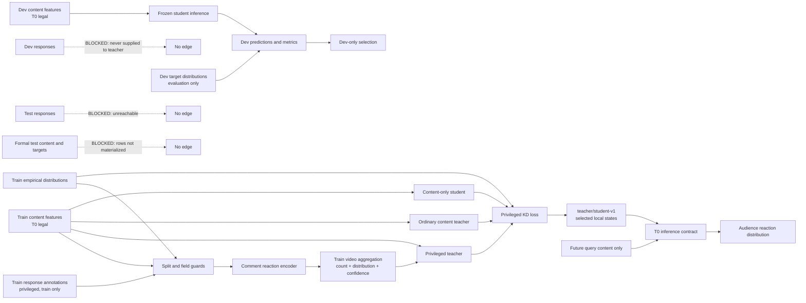

# Task30 H1 data-flow and unreachable-input proof

> Evidence identity: `DEVELOPMENT_EVIDENCE_ONLY`  
> Timepoint: `T0`  
> Split: `group_by_video_v1`  
> Formal test: `TEST_ROWS_NOT_MATERIALIZED`  
> Target test responses: `TEST_RESPONSES_UNREACHABLE`

This artifact is the required data-flow diagram for Task30. It describes the implemented CSMV development path and the fail-closed edges; it does not upgrade H1 to success or authorize Task40.

## Machine contract markers

TRAIN_RESPONSES_ALLOWED
DEV_SELECTION_CONTENT_AND_TARGETS_ONLY
TEST_RESPONSES_UNREACHABLE
TEST_ROWS_NOT_MATERIALIZED
CONTENT_ONLY_STUDENT_INFERENCE

## Edge contract

| Source | Destination | Status | Enforced by |
|---|---|---|---|
| train responses | train reaction encoder/teacher | allowed | formal-train membership, video mapping and required-field checks |
| train content | teacher and student | allowed | T0 content feature contract |
| train empirical distribution | supervision loss | allowed | finite normalized distribution contract |
| dev content | frozen student | allowed | train/dev-only canonical loader |
| dev targets | metrics and dev selection | allowed, evaluation only | runner selection contract |
| dev responses | teacher, cache or student | blocked | `TeacherFitRequest` split guard and train-only response derivation |
| test responses | any Task30 component | unreachable | no CLI input, no loader output and negative tests |
| formal test content/targets | model, selection or calibration | not materialized | canonical loader returns only train/dev; runner rejects test split |
| future query responses | inference | unreachable | content-only student interface rejects response/future fields |

## Executable evidence

- `tests/test_task30_contracts.py`: rejects dev/test teacher fit, response/future student fields and missing teacher fields.
- `tests/test_task30_data.py`: derives privileged inputs only for formal-train videos and emits no response text.
- `tests/test_task30_runner.py`: canonical loader materializes train/dev only and rejects test evaluation.
- `tests/test_task30_completion.py`: requires this diagram, the five machine markers and its hash-bound completion-freeze identity.
- `scripts/validate_task30_completion.py`: fails closed if the diagram identity or unreachable-input statuses are absent or altered.

## Interpretation boundary

The blocked edges are an implementation and evidence contract, not a proof about uninspected external systems. The private local run bundles remain redistribution-prohibited. No response text, sample identifier, prediction row, model byte or local absolute path is included here.
