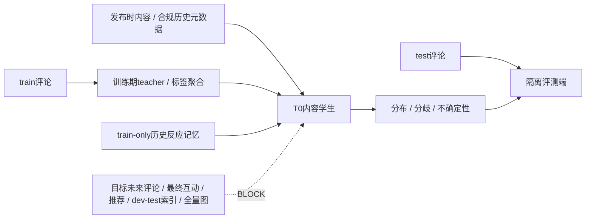

# 一页泄漏威胁模型

> 版本：v1.0；日期：2026-07-14；适用T0主任务及独立T+Δ次任务
> 信任边界：`HUMAN_GOLD test labels/comments`与模型输入、训练内存、索引和调参流程物理隔离。

| Threat ID | 威胁与攻击路径 | 当前历史证据 | 防护与自动验收 | 严重度/失败动作 |
|---|---|---|---|---|
| LT-01 | **目标评论泄漏**：评论文本、评论点赞、评论情绪或评论用户进入学生输入 | BERT“代表评论”、StepFun/规则情绪元、评论用户GCN | 输入schema禁评论列；test评论目录/loader独立；扫描配置与特征血缘；teacher输出只能经冻结蒸馏目标 | Critical；`LEAKAGE_BLOCKED` |
| LT-02 | **未来互动泄漏**：最终播放、点赞、转发、收藏、评论数、热度或增长曲线 | 旧48维含播放量/热度；评论CSV含最终互动 | 每字段登记`available_at_t0`与采集时点；无证据默认false；截图/OCR同样检查 | Critical；移除字段并重建数据/结果 |
| LT-03 | **推荐结果泄漏**：发布后相关推荐、热榜、排名或未来候选进入特征/检索 | 旧资产尚无完整血缘，不能证明不存在 | 禁止推荐/排名字段；候选只来自train或严格更早案例；保存候选ID与时间断言 | Critical；索引和结果作废 |
| LT-04 | **同作者/同视频/近重复泄漏**：发布者风格、重复BV或同源事件跨split | 随机split中39个test发布者有38个见于train；旧数据有强topic/publisher捷径 | video/post ID交集=0；publisher/topic group split；内容hash/感知hash与同源事件审计 | Critical（同实体）；近重复疑似先人工复核 |
| LT-05 | **索引污染**：dev/test进入检索库，或查询自身/未来样本被检索 | 新索引尚未构建；旧实验未提供统一索引manifest | 先split后index；索引ID必须是train子集；query不在index；记录版本、ID、时间、SHA-256 | Critical；删除并重建索引 |
| LT-06 | **全图构建穿越**：先用全量评论用户/相似度/边建图，再切train/test | `run_propagation_gcn.py`读取全体评论用户构图，存在跨split通道 | 先split；每个训练折独立构图；dev/test节点不得参与训练传播、归一化或图统计 | Critical；整次图实验作废 |
| LT-07 | **预处理/阈值穿越**：全量fit PCA、标准化、聚类、特征选择或看test调阈值 | 旧实验协议不统一；部分PCA虽train-only，不能外推到全部资产 | 所有fit操作封装为train-only；保存fit ID范围；阈值只在train/预注册dev冻结 | Critical；重跑全部受影响实验 |
| LT-08 | **伪时间泄漏**：时间缺失时按文件/BV顺序称为chronological | CUC仅883/2779有发布时间；195条旧子集时间字段大量为0 | 时间协议启用前检查覆盖率和可解析性；缺失时只声称train-only，不声称历史预测 | High；时间结果降级为探索并阻止时间claim |

## 最小门禁

正式split/运行必须同时满足：ID与group交集为0；目标评论和未来字段为0；索引为train子集；启用时间时所有候选早于查询；所有fit统计只来自train；图按split/折独立构建。任一失败输出`LEAKAGE_BLOCKED`。

## 审计边界

该模型覆盖已知高风险通道，但不是“已查全所有泄漏”的声明。近重复、同源事件、平台采样偏差、截图视觉泄漏和合法历史统计仍需数据字段级证据与人工复核。
