# 项目工作记忆

更新时间：2026-07-13

用途：以后做这个项目时，不再依赖翻聊天记录。每次确定问题、方案、实验结果或论文路线后，都同步更新本文件。

## 1. 项目总览思维导图

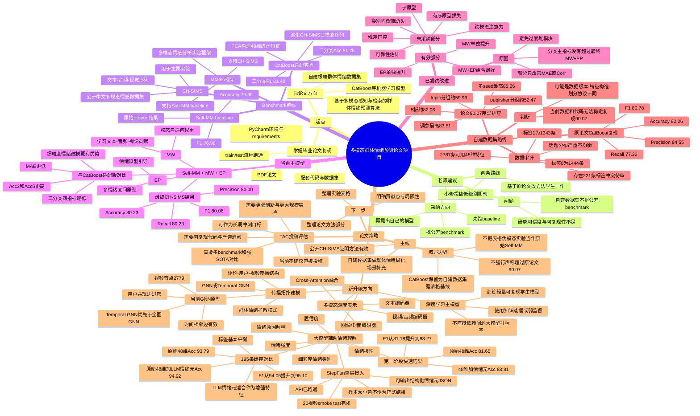

## 2. 当前任务流程图

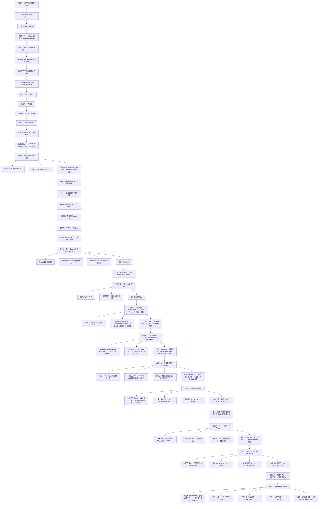

## 3. 决策记录表

| 时间 | 问题/方案 | 当前选择 | 为什么这样选 | 备选方案 | 下一步 |
|---|---|---|---|---|---|
| 2026-07-04 | 是否先跑通学姐原始项目？ | 先复现原论文代码、配置环境、跑train/test | 必须先知道原项目能否运行，避免空谈改进 | 直接重写模型 | 保留原始CatBoost复现结果 |
| 2026-07-04 | 原论文代码环境怎么处理？ | 使用项目自带venv/requirements，尽量不破坏原目录 | 最小改动、方便复现截图结果 | 新建完全独立环境 | 后续结果写入MMSA实验目录，避免污染原项目 |
| 2026-07-04 | 原论文数据加载以什么为准？ | 使用`5.预测向量.csv`中的48维特征和0/1标签 | 这是原代码实际训练入口，能稳定跑通 | 从原始评论/视频重新抽特征 | 后续审计确认数据缺失与标签冲突 |
| 2026-07-05 | 老师建议“找benchmark”是否采纳？ | 采纳，改为公开benchmark主线 | 自建数据集可信度不足，公开benchmark更适合投稿 | 继续只做自建数据集 | 选择CH-SIMS和MMSA/Self-MM |
| 2026-07-05 | 选哪个benchmark？ | 选择CH-SIMS | 中文多模态情感数据，和原论文中文情绪方向更近 | MOSI/MOSEI等英文数据 | 下载/配置CH-SIMS特征文件 |
| 2026-07-05 | 选哪个baseline？ | 选择Self-MM | MMSA中已有实现，是多模态情感分析常用baseline，适合作为主干 | TFN、MulT、MISA、MMIM等 | 先跑通Self-MM baseline |
| 2026-07-05 | 是否保留CatBoost路线？ | 保留为自建数据集强基线，不作为公开benchmark主模型 | CatBoost适合48维人工表格特征；但不适合CH-SIMS多模态序列主线 | 完全抛弃CatBoost | 论文中分清“公开benchmark主实验”和“自建场景补充” |
| 2026-07-05 | 新模型的核心创新怎么定？ | Self-MM + MW + EP | MW解释模态贡献，EP提供情绪结构引导，轻量且可解释 | 大规模重写Self-MM或引入复杂Transformer | 实现并跑CH-SIMS三seed |
| 2026-07-05 | MW如何设计？ | 使用模态自适应门控权重 | 能学习文本/音频/视觉在不同样本中的贡献，贴合“多模态感知” | 固定拼接、简单平均、注意力大模块 | 作为消融项单独测试 |
| 2026-07-05 | EP如何设计？ | 使用多情绪区间原型，而不是仅正负二原型 | CH-SIMS标签细粒度，五区间原型比二原型更合理 | 正/负二原型、无原型 | 作为消融项单独测试 |
| 2026-07-05 | 门控是否加约束？ | 加温度和熵约束 | 防止某一模态过早“一家独大”，训练更稳 | 不加约束 | 纳入最终MW配置 |
| 2026-07-05 | 最终CH-SIMS主模型选哪个？ | Self-MM+MW+EP refined版本 | Accuracy/F1四指标最好：Acc 80.23、F1 80.06 | residual、balanced_aux、reliability、subprototype、cross_attention | 固定为论文主模型 |
| 2026-07-05 | 有序原型损失是否保留？ | 不保留 | 虽然MAE/Corr有改善，但分类主指标低于最终MW+EP，且用户要求取消第一改动 | 作为回归指标补充 | 仅保留历史结果，不作为主模型 |
| 2026-07-05 | 残差门控是否保留？ | 不保留为主模型 | 回归稳定性好，但Accuracy/F1不如最终MW+EP | 用作附录讨论 | 主文不采用 |
| 2026-07-05 | 类别均衡辅助头是否保留？ | 不保留 | Acc5没有提升，分类主指标不如最终模型 | 继续调loss权重 | 不再作为主要方向 |
| 2026-07-05 | 可靠性估计/子原型/跨模态注意力是否保留？ | 不保留 | 三者独立消融均未超过Self-MM+MW+EP | 继续复杂化模块 | 停止堆模块，转向论文叙述 |
| 2026-07-05 | CH-SIMS标签分布是否需要分析？ | 已做标签分布统计 | 解释Acc5和类别偏斜问题，帮助写实验分析 | 不分析类别分布 | 在论文实验分析中引用 |
| 2026-07-05 | 自建数据集是否能直接跑Self-MM？ | 不能直接跑 | 自建数据只有48维人工特征，不是文本/音频/视觉序列；强行跑会概念不严谨 | 构造伪模态版本 | 伪模态只作为补充实验，不称为原始Self-MM |
| 2026-07-05 | 是否尝试Tabular MW+EP？ | 尝试，但不作为主结论 | 可以验证MW+EP迁移到表格特征的表现；结果低于CatBoost | 不做迁移实验 | 结论写成CatBoost更适合自建表格数据 |
| 2026-07-07 | 原论文CatBoost 90.07%与当前82.26%怎么解释？ | 做四类差异排查 | 不能凭猜测解释，需要实验支持 | 直接说论文有问题 | 多seed、指标口径、分组划分、调参全部跑完 |
| 2026-07-07 | 多seed能否接近90%？ | 不能，50个seed最高85.66% | 说明不是普通随机种子问题 | 继续更多seed | 当前足够说明趋势 |
| 2026-07-07 | 指标口径能否解释90%？ | 不能 | macro/weighted仍约82%，差距很小 | 换更多指标 | 论文中明确指标口径 |
| 2026-07-07 | 调参能否追到90%？ | 不能，简单调参最高83.51% | 说明不是参数没调好导致的大差距 | 大规模网格搜索 | 不建议继续追90，成本高且意义弱 |
| 2026-07-07 | 分组划分说明什么？ | 说明数据存在强topic/publisher相关性 | topic/publisher分组后性能大降，随机划分偏宽松 | 只报告随机划分 | 论文可把分组划分作为局限性/稳健性分析 |
| 2026-07-07 | 是否沿用论文90.07%？ | 不建议直接沿用 | 当前配套代码和数据无法稳定复现；强行沿用风险大 | 在背景中引用原论文报告值 | 主实验写当前可复现82.26/85.66上限 |
| 2026-07-07 | 后续项目记忆如何维护？ | 每次更新思维导图、流程图、决策表 | 用户不需要翻聊天上下文；也方便写论文和答辩 | 只在聊天里说明 | 持续更新`project_working_memory.md` |
| 2026-07-07 | 是否以IEEE Transactions on Affective Computing为投稿目标？ | 可作为长期冲刺目标，但当前版本不建议直接投 | TAC是情感计算领域高水平Transactions，通常要求强创新、多数据集、充分SOTA对比、严谨统计与可复现性；当前项目主要是Self-MM轻量改进+CH-SIMS单benchmark+自建数据补充，证据强度不足 | 直接投稿TAC；先投低一级SCI/EI期刊；扩展成TAC级完整工作 | 若冲TAC，需要补至少2-3个benchmark、强baseline、统计显著性、理论贡献和可复现代码 |
| 2026-07-07 | 是否在CH-SIMS上同时比较CatBoost和Self-MM+MW+EP？ | 已完成对比 | 这是回答“传统机器学习与深度模型在同一benchmark上谁更好”的公平实验；CatBoost需适配CH-SIMS特征而非原论文特征原样复刻 | 只比较自建数据集；只比较Self-MM baseline | 论文中谨慎表述：CatBoost二分类略优，Self-MM+MW+EP细粒度指标更优 |
| 2026-07-09 | 是否用“大模型+深度学习”升级当前模型？ | 采纳为下一阶段升级路线，但先做最小可落地版本 | LLM能增强评论情绪理解和解释，深度模型保证可复现和推理成本；比继续微调Self-MM小模块更有论文创新性 | 直接用闭源LLM打标签；直接上复杂Graph Transformer；继续只做CatBoost | 第一阶段做LLM辅助标注/解释 + 轻量学生模型；第二阶段再引入GNN传播拓扑 |
| 2026-07-09 | 第一阶段是否有必要继续？ | 值得继续 | LLM-ready规则情绪元与原48维融合后，Accuracy从81.65%提升到83.81%，F1从81.18%提升到83.27%，说明评论情绪元有有效信号 | 放弃情绪元路线；直接做GNN；只调CatBoost | 接入真实LLM或本地情绪模型，把规则弱标签替换为LLM JSON情绪元 |
| 2026-07-09 | StepFun大模型能否接入当前流程？ | 已接入并完成20视频smoke test | Chat Completions API可用，`step-3.7-flash`能输出结构化情绪元JSON；缓存与学生模型训练流程已跑通 | 继续用规则弱标签；换其他LLM API；只做本地模型 | 扩大到至少200个视频，比较原48维、规则情绪元、LLM情绪元、48维+LLM情绪元 |
| 2026-07-09 | 扩大StepFun LLM情绪元实验后是否有效？ | 有效，但当前仍是子集结果 | 195个可用视频上，48维+LLM情绪元比原48维更高：Accuracy 93.79%→94.92%，F1 94.06%→95.10%；LLM情绪元only较弱，说明适合做增强而不是替代 | 停止LLM路线；直接全量跑；改做GNN | 下一步扩展到更多视频，并加入人工抽检和分组划分 |
| 2026-07-09 | GNN/Temporal GNN是否值得继续？ | 值得继续Temporal GNN，但不建议直接用稠密用户共现图 | 纯PyTorch GCN原型显示：发布者时间相邻边使F1从67.84%提升到70.13%；共享评论用户边过密，F1降到58.45%，说明存在过平滑 | 放弃GNN；直接全图GNN；只做CatBoost | 下一步做“48维+LLM情绪元+时间相邻图”的Temporal GCN/GraphSAGE |

## 4. 重要结果索引

| 内容 | 文件 |
|---|---|
| CH-SIMS最终四指标消融 | `D:\MMSA-CH-SIMS\final_self_mm_mw_ep_classic_ablation_results.md` |
| 自建数据集复跑结果 | `D:\MMSA-CH-SIMS\self_built_dataset_rerun_results.md` |
| CatBoost差异排查报告 | `D:\MMSA-CH-SIMS\catboost_diagnosis_report.md` |
| CH-SIMS上CatBoost与Self-MM+MW+EP对比 | `D:\MMSA-CH-SIMS\ch_sims_catboost_vs_self_mm_mw_ep.md` |
| LLM-ready情绪元学生模型快速试验 | `D:\MMSA-CH-SIMS\llm_ready_emotion_student_report.md` |
| StepFun真实LLM情绪元smoke test | `D:\MMSA-CH-SIMS\stepfun_llm_emotion_student_smoke_test.md` |
| StepFun LLM情绪元195条扩大实验 | `D:\MMSA-CH-SIMS\stepfun_llm_195_comparison_report.md` |
| 传播拓扑GCN原型实验 | `D:\MMSA-CH-SIMS\propagation_gcn_report.md` |
| 自建数据集审计 | `D:\MMSA-CH-SIMS\group_dataset_audit.md` |
| 标签分布统计 | `D:\MMSA-CH-SIMS\label_distribution_report.md` |
| 最终模型运行脚本 | `D:\MMSA-CH-SIMS\run_final_self_mm_mw_ep_ablation.py` |
| CatBoost排查脚本 | `D:\MMSA-CH-SIMS\diagnose_catboost_self_built.py` |
---

## 2026-07-09 追加记录：Temporal GNN 实验

### 项目总览思维导图更新

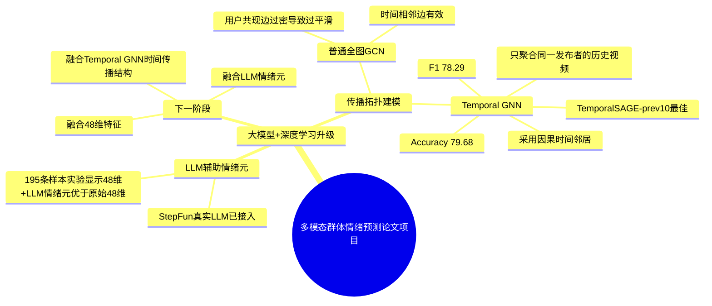

### 当前任务流程图更新

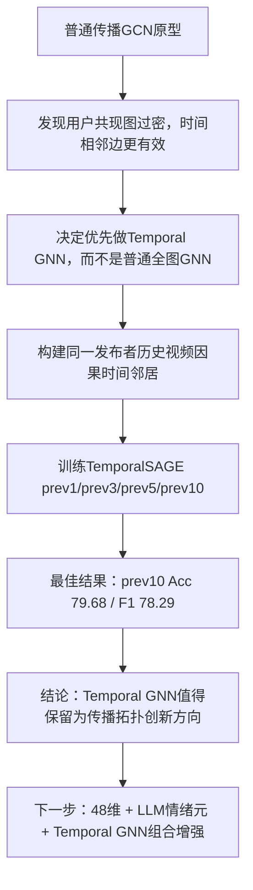

### 决策记录表追加

| 时间 | 问题/方案 | 当前选择 | 为什么这样选 | 备选方案 | 下一步 |
|---|---|---|---|---|---|
| 2026-07-09 | 下一步做普通全图GNN还是Temporal GNN？ | 做Temporal GNN | 普通GCN实验显示用户共现图过密、F1下降；发布者时间相邻边更有效，且更贴合“群体情绪传播过程” | 继续全图GCN、Graph Transformer、只做CatBoost/MLP | 构建因果时间邻居，只聚合同一发布者历史视频 |
| 2026-07-09 | Temporal GNN窗口选多大？ | 当前实验中prev10最好 | prev10达到Acc 79.68、F1 78.29，明显高于MLP 48维Acc 71.46、F1 67.84，也高于prev1/prev3/prev5 | prev1、prev3、prev5、更长窗口、自适应窗口 | 下一步尝试48维+StepFun LLM情绪元+TemporalSAGE |
| 2026-07-09 | Temporal GNN能否作为论文创新点？ | 可以保留为阶段性创新方向，但需要更严格验证 | 结果显示时间传播结构带来明显增益；叙述上也更贴合“群体情绪不是孤立静态属性，而会受历史传播上下文影响” | 只作为附录实验；放弃拓扑建模 | 后续补充chronological split或publisher-group split，降低时间泄漏/发布者记忆风险 |

### 重要结果索引追加

| 内容 | 文件 |
|---|---|
| Temporal GNN因果时间传播实验报告 | `D:\MMSA-CH-SIMS\temporal_gnn_report.md` |
| Temporal GNN运行脚本 | `D:\MMSA-CH-SIMS\run_temporal_gnn.py` |
| Temporal GNN原始JSON结果 | `D:\MMSA-CH-SIMS\experiments\temporal_gnn\temporal_gnn_results.json` |
---

## 2026-07-09 追加记录：LLM情绪元 + Temporal GNN 组合实验

### 项目总览思维导图更新

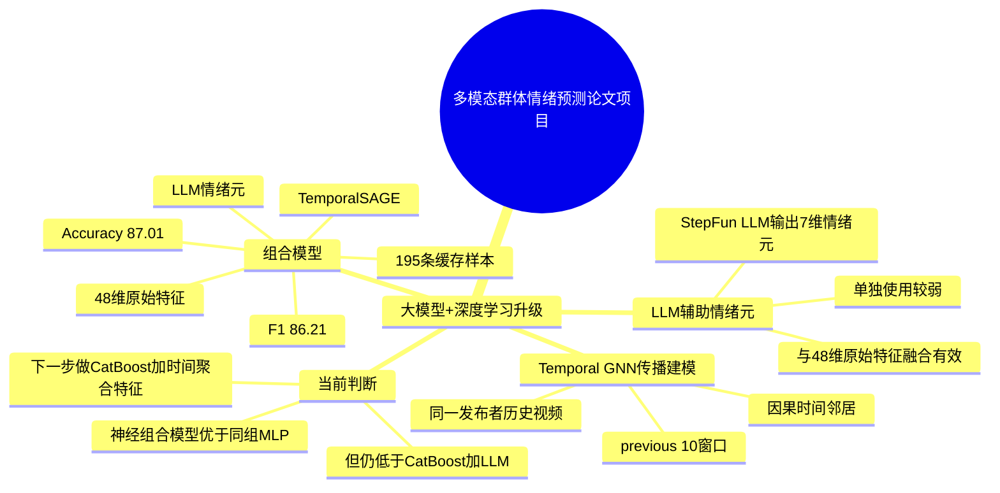

### 当前任务流程图更新

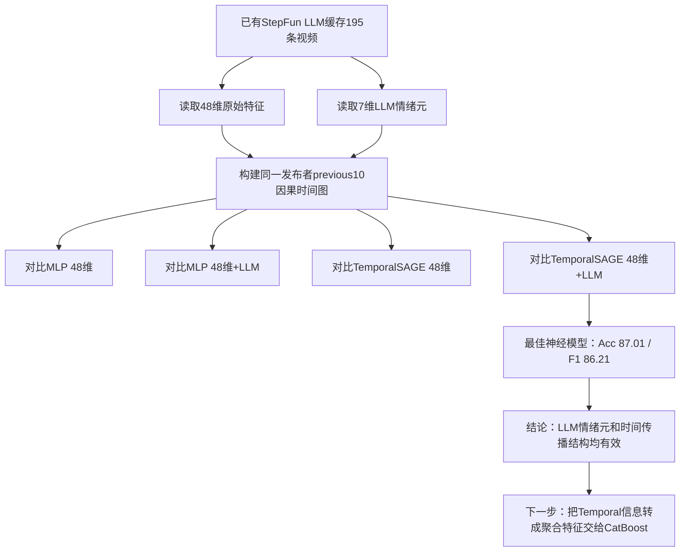

### 决策记录表追加

| 时间 | 问题/方案 | 当前选择 | 为什么这样选 | 备选方案 | 下一步 |
|---|---|---|---|---|---|
| 2026-07-09 | 是否把LLM情绪元与Temporal GNN结合？ | 已结合，形成TemporalSAGE 48维+LLM情绪元模型 | 前面分别证明LLM情绪元和时间传播结构都有增益，组合实验能验证二者是否互补 | 只做LLM+CatBoost；只做Temporal GNN；直接上复杂Graph Transformer | 保留组合实验结果，但继续寻找更强融合方式 |
| 2026-07-09 | 组合模型效果如何？ | 神经组合模型内部最好，但未超过CatBoost+LLM | TemporalSAGE 48维+LLM达到Acc 87.01、F1 86.21，高于MLP和单独Temporal；但低于CatBoost+LLM的Acc 94.92、F1 95.10 | 继续加深TemporalSAGE；扩大LLM样本；换GAT/Transformer | 优先把时间传播信息转成表格聚合特征，再交给CatBoost |
| 2026-07-09 | 论文里如何表述这组结果？ | 说“时间传播结构和LLM情绪元均能带来增益”，不说“深度学习全面超过CatBoost” | 当前证据支持模块有效，但不支持深度模型全面领先；诚实表述更安全 | 强行包装深度模型为最优；放弃Temporal结果 | 后续用CatBoost强学习器承接LLM和Temporal特征，争取更高主结果 |

### 重要结果索引追加

| 内容 | 文件 |
|---|---|
| LLM情绪元+Temporal GNN组合实验报告 | `D:\MMSA-CH-SIMS\llm_temporal_gnn_report.md` |
| LLM情绪元+Temporal GNN运行脚本 | `D:\MMSA-CH-SIMS\run_llm_temporal_gnn.py` |
| LLM情绪元+Temporal GNN原始JSON结果 | `D:\MMSA-CH-SIMS\experiments\llm_temporal_gnn\llm_temporal_gnn_results.json` |
---

## 2026-07-09 追加记录：CatBoost + LLM情绪元 + Temporal时间聚合特征

### 项目总览思维导图更新

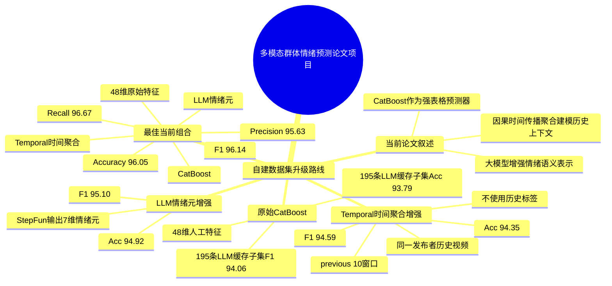

### 当前任务流程图更新

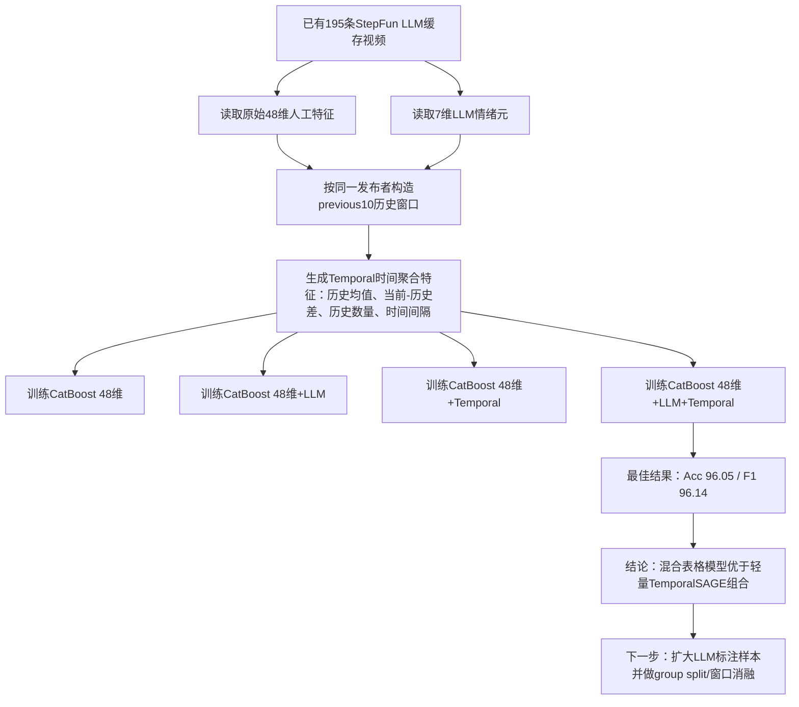

### 决策记录表追加

| 时间 | 问题/方案 | 当前选择 | 为什么这样选 | 备选方案 | 下一步 |
|---|---|---|---|---|---|
| 2026-07-09 | Temporal信息应该继续用神经GNN还是转成CatBoost特征？ | 转成Temporal时间聚合特征交给CatBoost | 自建数据集是48维表格特征，CatBoost更强；TemporalSAGE组合虽有效但F1只有86.21，CatBoost更适合当前数据形态 | 继续加深TemporalSAGE；上Graph Transformer；只保留CatBoost+LLM | 做CatBoost+LLM+Temporal混合实验 |
| 2026-07-09 | Temporal聚合是否使用历史标签？ | 不使用历史标签 | 使用历史标签会有标签泄漏风险，论文中很难自圆其说；只用历史特征均值和时间间隔更稳妥 | 使用历史真实标签；使用预测标签；只用历史数量 | 后续可以尝试用训练集内预测标签做stacking，但需严格防泄漏 |
| 2026-07-09 | CatBoost+LLM+Temporal效果如何？ | 当前195条LLM缓存子集上最佳 | Acc达到96.05，F1达到96.14，高于48维、48维+LLM、48维+Temporal，也高于TemporalSAGE组合 | 只报告CatBoost+LLM；只报告TemporalSAGE | 扩大LLM样本规模，做全量/更大子集验证和group split |
| 2026-07-09 | 论文主线如何表述？ | “大模型情绪元 + 因果时间传播聚合 + 强表格学习器” | 证据支持LLM和Temporal均带来增益；CatBoost作为最终预测器比轻量深度模型更强，更符合当前数据实际 | 强行说深度学习全面替代CatBoost；只讲CatBoost调参 | 方法名暂定“融合大模型情绪元与时间传播聚合的群体情绪预测方法” |

### 重要结果索引追加

| 内容 | 文件 |
|---|---|
| CatBoost+LLM情绪元+Temporal时间聚合实验报告 | `D:\MMSA-CH-SIMS\catboost_llm_temporal_report.md` |
| CatBoost+LLM情绪元+Temporal时间聚合运行脚本 | `D:\MMSA-CH-SIMS\run_catboost_llm_temporal.py` |
| CatBoost+LLM情绪元+Temporal时间聚合原始JSON结果 | `D:\MMSA-CH-SIMS\experiments\catboost_llm_temporal\catboost_llm_temporal_results.json` |
---

## 2026-07-09 追加记录：LLM情绪元与Temporal GNN两个模块阶段判断

### 项目总览思维导图更新

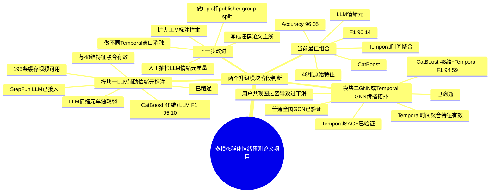

### 当前任务流程图更新

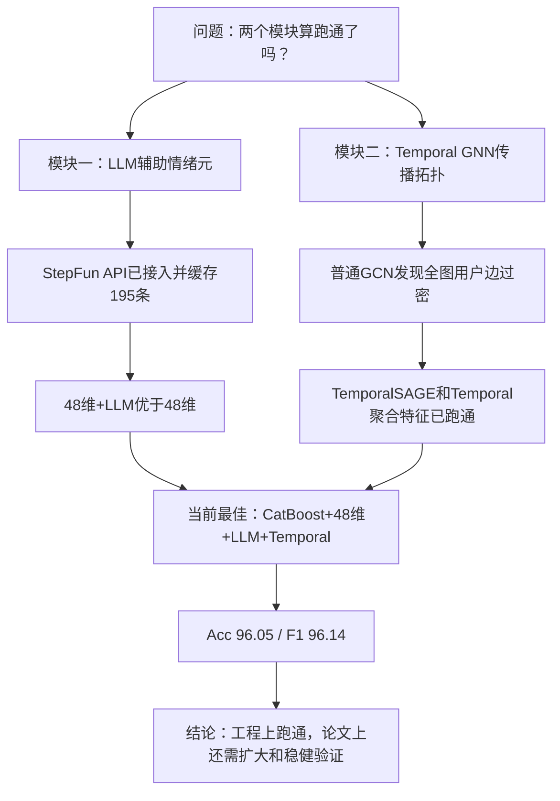

### 决策记录表追加

| 时间 | 问题/方案 | 当前选择 | 为什么这样选 | 备选方案 | 下一步 |
|---|---|---|---|---|---|
| 2026-07-09 | LLM辅助情绪元标注是否算跑通？ | 算跑通 | 已完成StepFun接入、JSON结构化输出、195条缓存样本、学生模型和CatBoost融合实验；48维+LLM相对48维有提升 | 继续只用规则情绪元；放弃LLM；直接全量调用LLM | 扩大到更多视频，并做人工抽检和成本记录 |
| 2026-07-09 | GNN/Temporal GNN传播拓扑是否算跑通？ | 算跑通，但普通全图GNN不作为主线，Temporal方向保留 | 普通GCN显示用户共现边过密，TemporalSAGE和Temporal聚合证明历史传播上下文有效 | 继续全图GNN；直接Graph Transformer；放弃拓扑 | 做Temporal窗口消融、publisher/topic group split，优先用Temporal聚合特征服务CatBoost主结果 |
| 2026-07-09 | 两个模块能否组合为论文主方法？ | 可以，但主方法建议是“LLM情绪元 + Temporal时间聚合 + CatBoost”，不是纯深度学习替代 | 当前最优结果来自CatBoost+LLM+Temporal，Acc 96.05、F1 96.14；证据不支持深度模型全面超过CatBoost | 强行包装为深度学习主干；只写CatBoost调参 | 扩大验证后写成“融合大模型情绪元与时间传播聚合的群体情绪预测方法” |

## 2026-07-10 更新：多模态深度表示阶段的数据可行性与实施顺序

### 1. 项目总览思维导图（本次更新）

- 群体情绪预测项目
  - 已完成的强基线
    - 自建数据：CatBoost + LLM 情绪元 + Temporal 聚合，195 个缓存样本上 Acc 96.05%、F1 96.14%
    - CH-SIMS：Self-MM + MW + EP 已完成基准与消融
  - 当前拟开展：多模态深度表示增强
    - 文本：标题、标签、简介、评论正文 -> 中文预训练编码器
    - 图像：封面 URL -> 下载封面 -> Chinese-CLIP/CLIP
    - 视频：视频 URL -> 合规补采原视频/抽帧 -> 帧级 CLIP，后续再评估 VideoMAE
    - 音频：由合法取得的视频提取音轨 -> Whisper/wav2vec2
    - 融合：先做后融合（特征拼接 + CatBoost/MLP），确认有效后再做 Cross-Attention
  - 数据现状
    - 3515 个 CSV、1 个快捷方式
    - 本地无 jpg/png/mp4/wav/mp3 等原始媒体文件
    - CSV 已保留标题、标签、简介、评论、视频地址、封面 URL

### 2. 当前任务流程图（本次更新）

数据字段与许可审计 -> 建立 BV 级样本主表 -> 文本编码基线 -> 48维+LLM+Temporal+文本向量 -> 下载并校验封面 -> 加入图像向量 -> 若原视频可合法获得，再做抽帧/音频 -> 后融合消融 -> 仅在后融合证明有效后尝试 Cross-Attention

当前所在节点：数据字段与模态可用性审计已完成；下一节点是建立 BV 级样本主表并实现文本深度表示。

### 3. 决策记录（本次更新）

| 日期 | 决策 | 为什么这样选 | 备选方案 | 下一步 |
|---|---|---|---|---|
| 2026-07-10 | 多模态深度学习先从文本分支和封面分支开始，不直接训练 VideoMAE/TimeSformer | 当前本地只有 CSV，没有原始视频和音频；标题、简介、标签、评论文本完整度更高，封面有 URL，工程成本和可复现性更可控 | 直接重新下载全部视频并训练 VideoMAE；只在 CH-SIMS 上做深度多模态 | 生成 BV 级主表，先提取中文文本 embedding 并与当前最优 CatBoost 特征做严格消融 |
| 2026-07-10 | 第一版采用后融合：深度 embedding 与 48维、LLM情绪元、Temporal 特征拼接，再交给 CatBoost/MLP | 能单独衡量每个模态的增益，适合当前约 2787 个样本的小数据规模 | Cross-Attention/Transformer Fusion 端到端训练 | 后融合有效后再实现注意力融合，避免把复杂度误当提升 |
| 2026-07-10 | 论文实验必须采用按时间或发布者分组的无泄漏划分 | 同一发布者、相邻视频和相关视频进入训练测试两侧会导致指标虚高；现有 195 样本随机/BV排序结果只能视为探索性结果 | 继续随机 7:3 划分 | 固定 time split 与 publisher-group split，并重新报告均值、标准差和置信区间 |

---

## 2026-07-10 更新：BERT文本深度表示融合实验已跑通

### 1. 项目总览思维导图（本次更新）

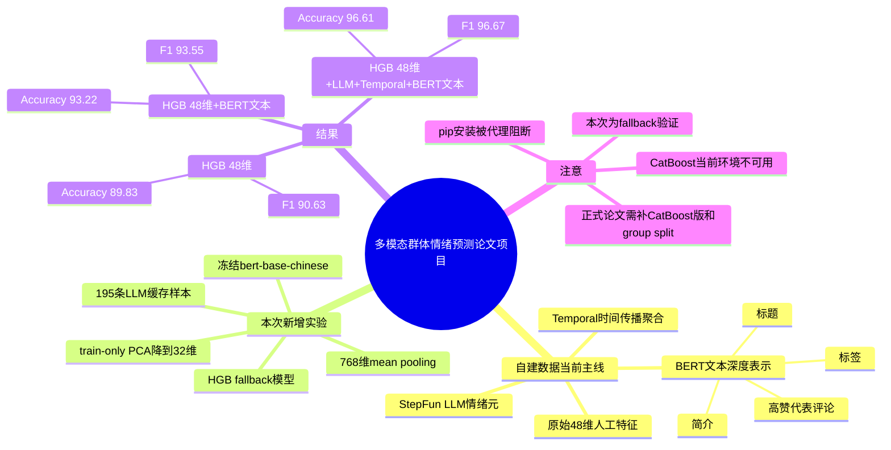

### 2. 当前任务流程图（本次更新）

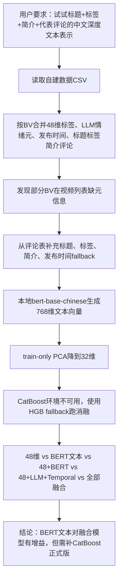

### 3. 决策记录表追加

| 时间 | 问题/方案 | 当前选择 | 为什么这样选 | 备选方案 | 下一步 |
|---|---|---|---|---|---|
| 2026-07-10 | 文本深度表示用什么输入？ | 标题、标签、简介、高赞前20条代表评论 | 这些字段在CSV中可直接取得，覆盖视频语义和早期群体反馈；工程成本最低，可先验证语义信息是否有效 | 只用标题；用全部评论；用LLM摘要评论 | 后续可比较top-k评论数量、评论排序策略和LLM评论摘要 |
| 2026-07-10 | 文本编码器怎么选？ | 本地冻结`bert-base-chinese` mean pooling | 本机已有完整模型目录，无需联网；冻结编码器适合195条小样本，避免端到端过拟合 | Chinese-RoBERTa；BGE/Qwen embedding；微调BERT | 若能联网或已有模型，补跑BGE/Qwen embedding对比 |
| 2026-07-10 | 768维文本向量如何进入小样本分类器？ | 每次split内只用训练集fit PCA降到32维 | 防止高维小样本过拟合，同时避免PCA在全量数据上fit造成泄漏 | 直接拼接768维；用SelectKBest；用MLP投影层 | 后续固定此防泄漏策略用于CatBoost版 |
| 2026-07-10 | CatBoost不可用时是否停止？ | 不停止，先用sklearn HGB作为可执行fallback | 当前CatBoost包缺失且pip安装被代理阻断；HGB可验证BERT文本是否含有效增量信息 | 等网络恢复再跑；改用RandomForest/LogisticRegression | 环境恢复CatBoost后，用同一数据加载和文本缓存补跑正式CatBoost消融 |
| 2026-07-10 | 本次BERT文本实验结论 | BERT文本值得保留为候选创新模块 | HGB 48维+BERT 相比48维 F1从90.63升至93.55；全融合 F1达到96.67 | 若group split失效则降级为辅助实验 | 统一数据加载逻辑，补CatBoost版、time split和publisher group split |

### 4. 重要结果索引追加

| 内容 | 文件 |
|---|---|
| BERT文本融合实验报告 | `D:\MMSA-CH-SIMS\bert_text_fusion_report.md` |
| BERT文本融合运行脚本 | `D:\MMSA-CH-SIMS\run_bert_text_fusion_experiment.py` |
| BERT文本融合原始JSON结果 | `D:\MMSA-CH-SIMS\experiments\bert_text_fusion\bert_text_fusion_results.json` |
| BERT文本向量缓存 | `D:\MMSA-CH-SIMS\experiments\bert_text_fusion\bert_text_embeddings.npz` |

---

## 2026-07-10 更新：CatBoost环境修复并复跑BERT文本融合

### 1. 项目总览思维导图（本次更新）

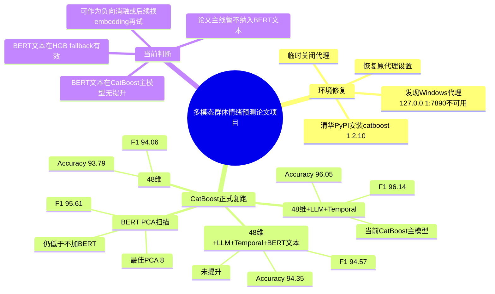

### 2. 当前任务流程图（本次更新）

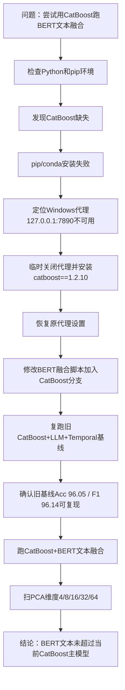

### 3. 决策记录表追加

| 时间 | 问题/方案 | 当前选择 | 为什么这样选 | 备选方案 | 下一步 |
|---|---|---|---|---|---|
| 2026-07-10 | CatBoost无法安装怎么办？ | 临时关闭Windows用户代理，使用清华PyPI安装，安装后恢复代理 | 代理指向127.0.0.1:7890但服务不可用，pip和conda都被阻断；临时关闭是可逆修复 | 手动下载wheel离线安装；改用HGB fallback；重建conda环境 | 后续若再次安装包，先检查代理服务是否开启 |
| 2026-07-10 | BERT文本是否进入CatBoost最终主模型？ | 暂不进入 | CatBoost 48+LLM+Temporal F1=96.14；加入BERT文本后PCA=32降到94.57，PCA扫描最佳8维也只有95.61 | 使用BGE/Qwen embedding替代BERT；用文本做单独辅助任务；改用注意力融合 | 主表保留CatBoost 48+LLM+Temporal；BERT文本作为探索性消融或后续换embedding再试 |
| 2026-07-10 | HGB fallback中BERT有效但CatBoost中无效，如何解释？ | 以CatBoost正式结果为主 | 论文主方法最终预测器是CatBoost；fallback只能说明文本有信息，但不能证明加入CatBoost主模型有效 | 同时报告HGB结果作为补充 | 写论文时谨慎表述：BERT文本在当前CatBoost配置下未带来稳定增益 |

### 4. 重要结果索引追加

| 内容 | 文件 |
|---|---|
| BERT文本融合报告（已更新CatBoost正式复跑） | `D:\MMSA-CH-SIMS\bert_text_fusion_report.md` |
| CatBoost文本PCA维度扫描 | `D:\MMSA-CH-SIMS\experiments\bert_text_fusion\catboost_text_pca_sweep.json` |
| 旧CatBoost+LLM+Temporal复跑结果 | `D:\MMSA-CH-SIMS\experiments\catboost_llm_temporal\catboost_llm_temporal_results.json` |

---

## 2026-07-13 权威更新：第四章 T-AFFC 十个月主纲

- 用户冻结论文范围：只继承第四章“基于多模态感知与检索的群体情绪预测”；第三章传播链和Temporal GNN不进入主方法。
- 新主问题：推理时不读取未来评论，仅凭内容与train-only历史反应记忆预测公众诱发情绪分布、分歧和不确定性。
- 第一主benchmark：CSMV/MSA-CRVI；第二主benchmark优先iNews、备选NEmo+；MVIndEmo因标签由模型自动聚合，降为银标签辅助集。
- 自建数据重定位：CUC-IGPE-v2中文无标签/银标签压力测试；必须重建时间、标签来源和自然流行率协议，但不再要求大规模人工重标。
- CatBoost/HGB保留为强基线；Self-MM+MW+EP、LLM、Temporal、GNN均为历史探索，不再代表最终创新。
- 后续所有任务以 `D:\MMSA-CH-SIMS\TAFFC_CH4_10_MONTH_MASTER_PLAN_20260713.md` v1.5 为SSOT；第17节是Codex任务树详细执行规格的权威版本。
- 三张项目记忆视图：`D:\MMSA-CH-SIMS\project_working_memory_ch4_master_20260713.md`。
- 2026-07-13现实约束更新：用户难以组织人工标注。公开人工标注benchmark承担核心真值；LLM/规则/模型集成只能生成训练银标，自建集不再承担核心准确率结论。
- 2026-07-13开工顺序更新：先完成三日准备包（T0政策、目录隔离、环境锁定、密钥治理、实验配置），再进入数据下载与模型开发。
- 2026-07-13平台分工修订：用户所指为Codex内部项目。建立以D:\MMSA-CH-SIMS为根目录的单一Codex项目；设置00总控任务并按阶段拆分任务；本地文件继续承担SSOT，Matgo作为M4以后按需GPU平台。
- 2026-07-13位置核验：当前工程资产已确认位于D:\MMSA-CH-SIMS；原论文配套代码/数据位于D:\李佳怡毕业论文配套代码并保持外部只读来源。
- 2026-07-14开工准备验收：本地准备项完成，`scripts/run_preparation_checks.py`判定M1只读工作可开始；正式CARM环境因faiss缺失与M1门未过继续阻断，账户侧凭证轮换确认前禁止API/付费调用。验收事实源为`PREPARATION_ACCEPTANCE_REPORT.md`。
