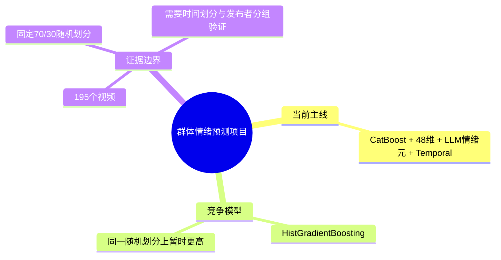
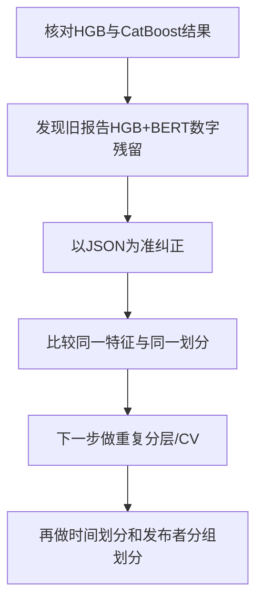

# 项目工作记忆补充：HGB 与 CatBoost 对比（2026-07-10）

## 项目总览思维导图更新

## 当前任务流程图更新

## 决策记录

| 日期 | 决策 | 原因 | 备选方案 | 下一步 |
|---|---|---|---|---|
| 2026-07-10 | 暂不把HGB直接替换为论文主模型 | HGB在一次固定随机划分上高，但样本仅195，且模型种子未改变测试集 | 直接选HGB；保留CatBoost | 做重复分层/CV、时间划分、发布者分组划分 |
| 2026-07-10 | 以JSON作为正式结果来源 | 报告曾残留96.61%旧数字；JSON与脚本输出可追溯 | 继续沿用旧报告 | 使用勘误文件并同步论文表格 |

## 可追溯结果

- HGB `48维+LLM+Temporal`：Accuracy 98.31%，F1 98.31%。
- CatBoost `48维+LLM+Temporal`：Accuracy 96.05%，F1 96.14%。
- HGB `48维+LLM+Temporal+BERT`：Accuracy 94.92%，F1 95.08%。
- CatBoost `48维+LLM+Temporal+BERT`：Accuracy 94.35%，F1 94.57%。
- 勘误说明：[bert_text_fusion_result_correction.md](D:/MMSA-CH-SIMS/bert_text_fusion_result_correction.md)
