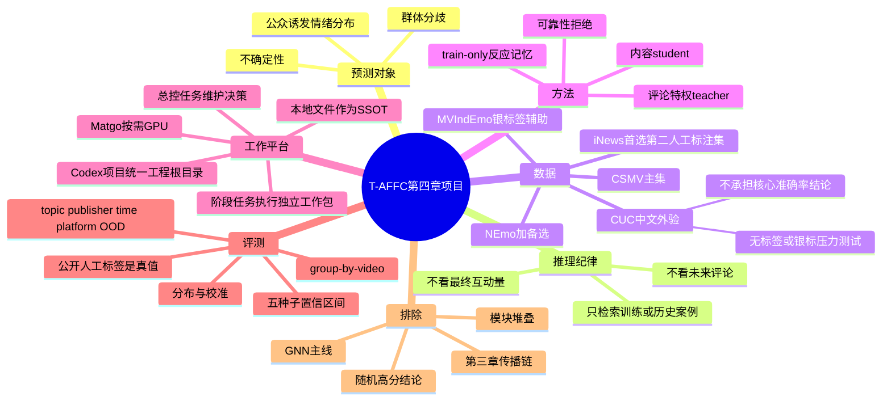
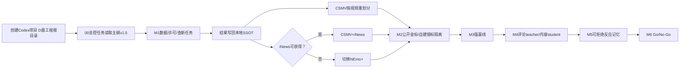

# 项目记忆更新：第四章 T-AFFC 十个月主纲（2026-07-13）

## 权威状态

- 当前SSOT：`D:\MMSA-CH-SIMS\TAFFC_CH4_10_MONTH_MASTER_PLAN_20260713.md`
- 主纲版本：v1.5
- 已核验工程资产：计划、报告、实验脚本、模型、日志和结果均在 `D:\MMSA-CH-SIMS`；原始论文配套代码/数据仍在 `D:\李佳怡毕业论文配套代码`，作为外部只读来源。
- 周期：2026-07-13—2027-05-12
- 覆盖范围：第四章“多模态感知与检索的群体情绪预测”
- 被排除主线：第三章传播链、Temporal GNN、现有195条LLM/Temporal随机高分
- 与旧路线冲突时：以本文件指向的新主纲为准

## 项目总览思维导图

## 当前任务流程图

## 决策记录表

| 日期 | 决策 | 为什么 | 备选 | 下一步 |
|---|---|---|---|---|
| 2026-07-13 | 第四章为唯一论文主线 | 用户明确要求，且能形成检索增强受众反应预测闭环 | 第三章传播GNN | M1只做第四章数据与查新 |
| 2026-07-13 | 标签必须独立重建 | 第四章初始标签依赖第三章，且现有版本冲突 | 直接沿用二分类 | 公开分布标签为主，自建集重标/校准 |
| 2026-07-13 | 预测时不使用目标未来评论 | 这是早期预测的基本时间边界；当前LLM特征存在泄漏 | 把评论当普通输入 | 评论只作训练期特权监督 |
| 2026-07-13 | CSMV为第一主benchmark | 任务、视频和人工评论标签最匹配 | CH-SIMS、NEmo+、iNews | 下载、校验、按video重划分 |
| 2026-07-13 | 初始MVIndEmo第二主集决定已撤销 | 它的分布标签由模型聚合，不适合作为第二个人工真值 | 保留为银标签辅助 | iNews优先、NEmo+备选，8月1日前审计 |
| 2026-07-13 | 核心方法为comment-privileged student + calibrated response memory | 保留第四章检索思想并避免一般RAG撞车 | MW+EP、普通RAG、GNN | M1贡献级查新，M4/M5分别验证 |
| 2026-07-13 | CatBoost/HGB保留为强基线 | 表格小样本上依然有价值，但随机高分不是泛化证据 | 完全弃用机器学习 | 新旧方法统一OOD与校准评测 |
| 2026-07-13 | 自建数据只作中文跨平台外验 | 模态与标签不完整、发布者捷径严重 | 继续作为唯一主数据 | 重建canonical表与400—600条标注子集 |
| 2026-07-13 | 不再要求大规模人工标注 | 现实条件无法组织多标注者金标 | 2500—3000条三人盲标或400—600条五人标注 | 公开benchmark人工标签承担核心真值 |
| 2026-07-13 | 自建集改为无标签/银标签压力测试 | LLM伪标签不能作为独立测试真值 | 用LLM直接生成测试标签 | 只报告拒绝率、域距离、一致率和案例，不宣称核心准确率 |
| 2026-07-13 | 有选择地吸收Claude方案 | 构念限定、发布前/早期场景、head-agnostic和阶段门有价值 | 原样采用批量视频补采、双论文和高预算标注 | 已写入主纲v1.1 |
| 2026-07-13 | 开工前执行三日准备包 | 先锁定T0、环境、目录、安全和实验记录，避免不可复现 | 直接下载或训练 | 完成准备包后才进入CSMV审计 |
| 2026-07-13 | 建立一个Codex项目，工作拆成项目内任务 | 项目统一目录和文件，任务隔离阶段上下文 | 单一超长任务或多个无关目录 | D:\MMSA-CH-SIMS作为项目根；保留00总控任务 |
| 2026-07-13 | Matgo按需提供GPU | 后续冻结编码器和正式多种子实验需要GPU | 现在就租高端多卡 | M4前按显存与时长清单选择实例 |
| 2026-07-13 | 核验并确认D:\MMSA-CH-SIMS为当前工程资产目录 | 已包含实验脚本、报告、日志、模型和v1.4总纲；当前窗口无待迁移的项目产物 | 继续使用临时工作目录 | 在Codex项目中打开该目录，并从总纲/项目记忆续接 |
| 2026-07-14 | 主纲升级为v1.5并内嵌Codex任务树详细执行规格 | 后续任务需要从单一权威文件读取目标、步骤、门禁、验收和交接要求 | 继续让总纲与独立规格并列为双重权威 | 总纲第17节优先；独立规格仅作便捷副本 |

## 立即下一步

先执行三日开工准备包：锁定T0、建立目录与Git忽略规则、固定环境、轮换凭证、建立实验配置模板；完成后立即执行CSMV下载与按视频分组的数据审计，并在2026-08-01前完成iNews可用性判定（不可用则切换NEmo+）。
