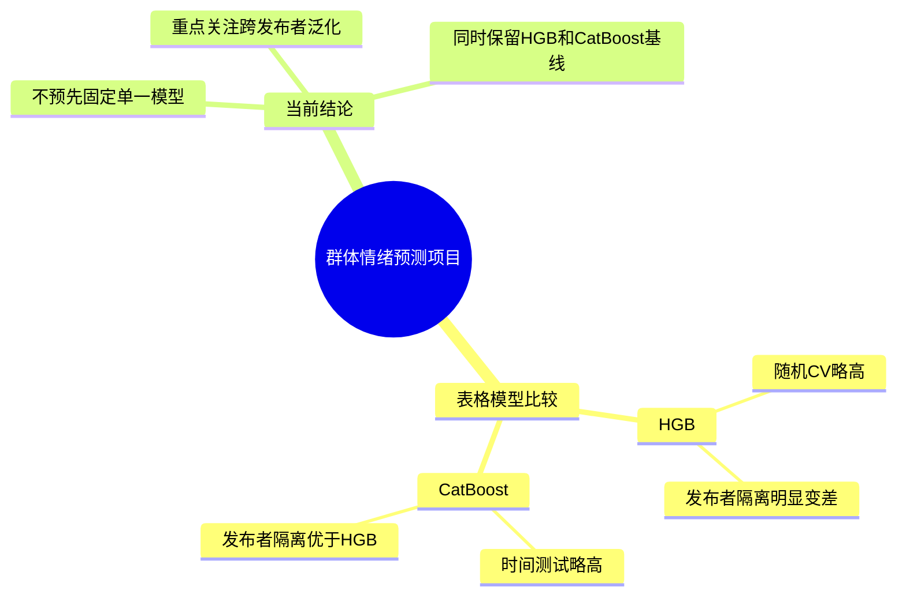
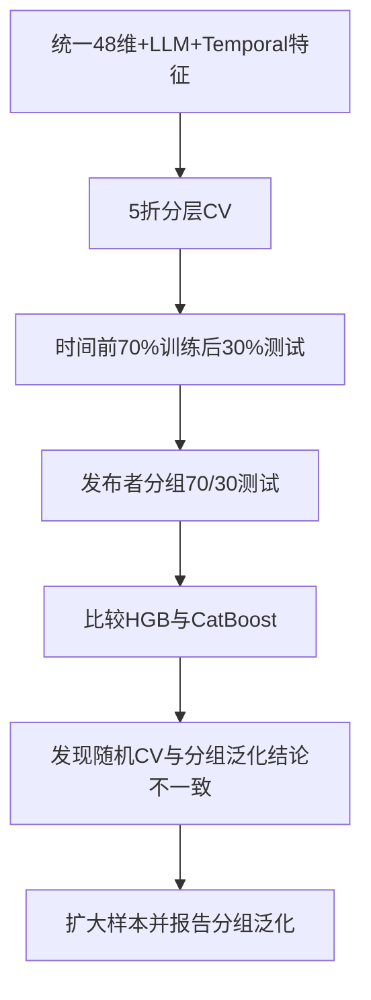

# 项目记忆更新：HGB 与 CatBoost 正式比较（2026-07-10）

## 项目总览思维导图

## 当前任务流程图

## 决策记录表

| 日期 | 决策 | 为什么 | 备选方案 | 下一步 |
|---|---|---|---|---|
| 2026-07-10 | 暂不替换CatBoost，也不直接宣布HGB最优 | HGB随机CV略高，但发布者分组F1显著低于CatBoost | 直接选HGB；直接保留CatBoost | 扩大样本，重复分组验证并报告置信区间 |
| 2026-07-10 | 将发布者分组结果作为关键泛化证据 | 它能检验模型是否依赖训练发布者的局部模式 | 只报告随机划分 | 论文同时报告随机CV、时间测试和分组测试 |

## 关键结果

- 5折分层CV：HGB Accuracy/F1 = 93.33%/93.56%；CatBoost = 92.48%/92.71%。
- 时间70/30：HGB Accuracy/F1 = 81.36%/79.25%；CatBoost = 81.92%/79.93%。
- 发布者分组70/30：HGB Accuracy/F1 = 60.25%/18.18%；CatBoost = 76.90%/48.64%。
- 详细报告：[formal_hgb_catboost_comparison_report.md](D:/MMSA-CH-SIMS/formal_hgb_catboost_comparison_report.md)
