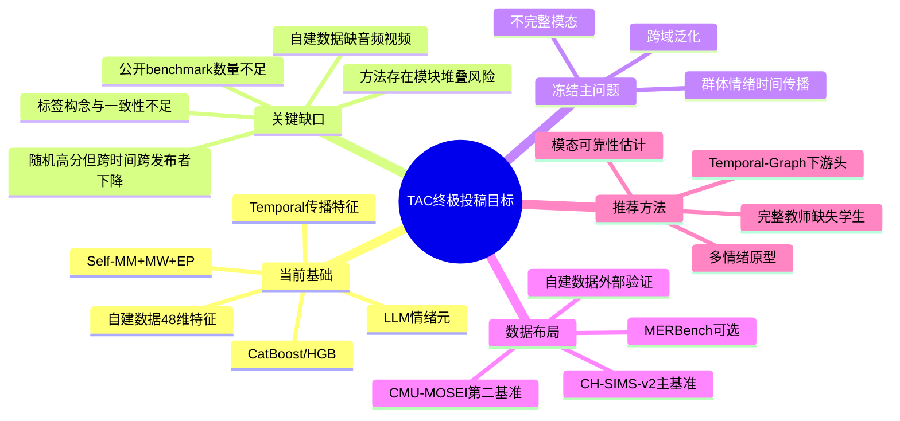
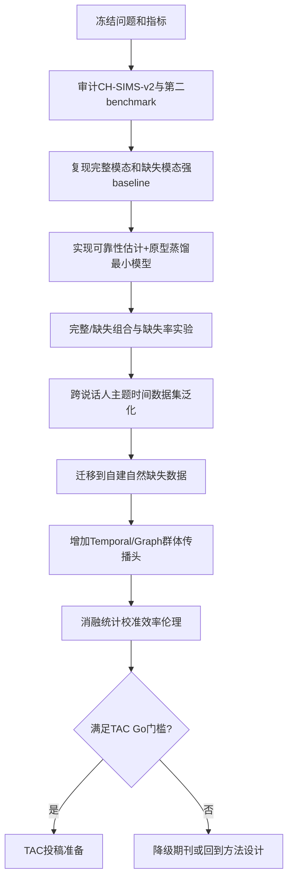

# 项目记忆更新：IEEE TAC 终极投稿路线（2026-07-13）

## 1. 项目总览思维导图

## 2. 当前任务流程图

## 3. 决策记录表

| 日期 | 问题 | 当前决策 | 为什么 | 备选方案 | 下一步 |
|---|---|---|---|---|---|
| 2026-07-13 | CatBoost高分是否阻止深度学习路线 | 否；CatBoost保留为自建表格强基线，深度学习转向公开原始多模态benchmark | CatBoost适合48维表格；时间和发布者隔离结果显示高分不等于泛化 | 完全放弃深度学习；强行在自建表格上用Transformer | 在CH-SIMS-v2复现完整和缺失模态baseline |
| 2026-07-13 | 自建数据缺音视频怎么办 | 定位为自然缺失模态与群体情绪动态外部验证集 | 不应把缺失数据包装为完整多模态；真实缺失是有价值的应用设置 | 重新抓取音视频；放弃自建数据 | 审计URL可恢复性和数据许可 |
| 2026-07-13 | TAC论文核心问题 | 不完整模态下的可靠情感建模与跨域群体传播 | 同时连接公开benchmark、自建数据和原论文主题 | 只做Self-MM加模块；只做LLM标注 | 冻结question/estimand/primary metric |
| 2026-07-13 | 模型创新如何收敛 | 只保留“可靠性估计+原型蒸馏”作为核心，Temporal/Graph做下游扩展 | 避免门控、原型、LLM、GNN简单堆叠 | 继续增加更多模块 | 先用两数据集检验核心机制 |
| 2026-07-13 | benchmark选择 | CH-SIMS-v2主基准，CMU-MOSEI第二基准，MERBench可选 | 中文贴合、自带音视频；MOSEI提供规模和跨说话人泛化 | 只用CH-SIMS；MELD/IEMOCAP | 数据许可与下载审计后最终冻结 |

## 当前下一步

优先完成 Phase 0：审计 CH-SIMS v2 的原始音频、视频、文本和官方划分，随后选定一个公开缺失模态 baseline 并复现。

详细路线：`D:\MMSA-CH-SIMS\ieee_tac_gap_and_roadmap_20260713.md`
